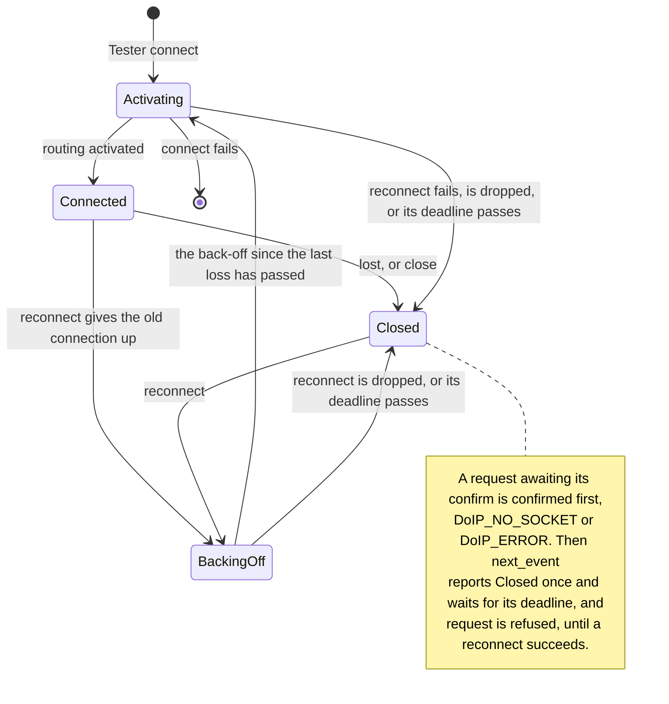
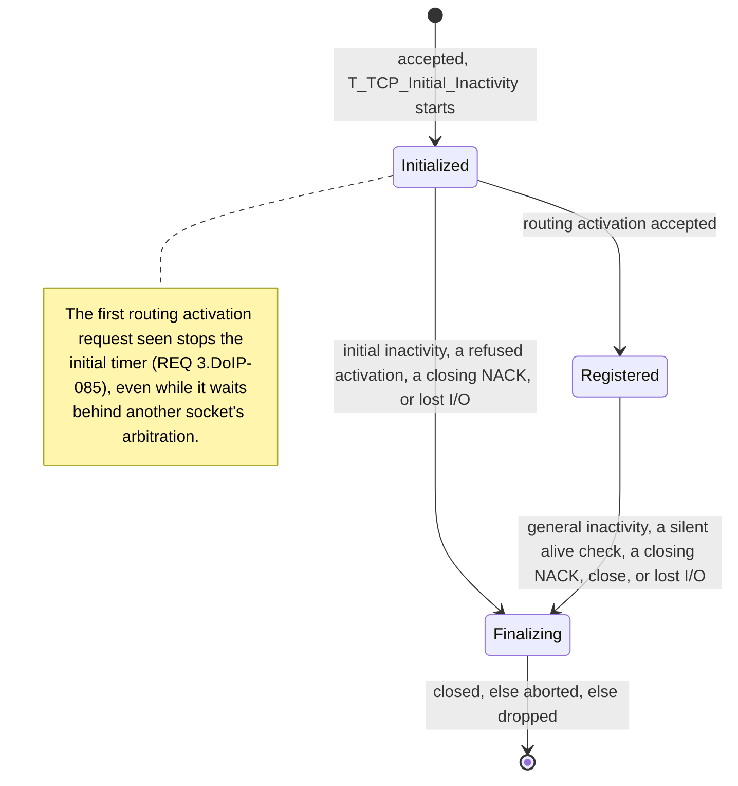

# Architecture

This document describes `simple_doip` **as it is today** — the shape of the crate,
why it is shaped that way, and the known rough edges a new maintainer should be
aware of before changing anything. It is written for someone who has never seen
the code.

> **Provisional.** This is a working document, not the crate's formal
> architecture record. The stack's sphinx-needs architecture set under
> `docs/architecture/` will take this crate's architecture in; so far it covers
> `uds_services` only, and until this content moves there, this file is the
> record.

For usage, feature flags, and the current gap list, see [`README.md`](README.md).

> **A note on spec citations.** This crate is built against **ISO 13400-2:2019**,
> and a clause, table, figure or requirement cited with no document named is
> that one's. A citation of any other document names it and its edition
> (`ISO 14229-5:2022 REQ 7.9`). A § is a section of this file. Cite a locator only after reading it in the
> standard's text. An earlier review of this crate found and removed
> a batch of fabricated spec locators, written when no reader could check one; the
> rule exists so that never recurs. A locator nobody has read is worse than none —
> "per ISO 13400-2" without one is fine. Where a claim rests on a figure, say so,
> and do not paraphrase a figure that has not been read.

---

## 1. What this crate is

`simple_doip` implements Diagnostics over IP (DoIP), the vehicle-diagnostics
transport specified in ISO 13400-2. A DoIP frame is an 8-byte generic header
(protocol version, its bitwise inverse, a 16-bit payload type, a 32-bit payload
length) followed by a payload whose structure is determined by the payload type.

The crate models protocol **structure** only. It knows what a diagnostic message
looks like on the wire; it does not know what the UDS bytes inside one *mean*.
That boundary is deliberate and load-bearing: the semantics of a diagnostic
identifier are application/ECU configuration, not a transport-library concern.
`Payload::DiagnosticMessage` carries `user_data: &[u8]` and nothing more.

The forcing function for the current design is a next-generation sensor that must
act as a diagnostic server/ECU on **strict no-alloc bare metal** — no allocator,
no `Vec`, no owned forms, everything borrows plus fixed buffers. Every layering
decision below follows from that.

---

## 2. Layering

Capability is added in Cargo-feature tiers, each building on the previous.
`default = []`, so the bare crate is the `no_std` core, running up through
owned/alloc mirrors, `std` I/O and errors, the tokio-util codec, and finally the
async client/server. `connection` stands apart: it builds on the core alone, and
is `no_std` with no allocator:

| Tier | Cargo feature | What it adds | Key files |
|---|---|---|---|
| L0 (external) | — | byte-level `Decode`/`Encode` traits, `Incomplete`, `TrailingBytes`, `take` | `automotive-wire-codec` crate |
| Borrowed core | *(none)* | `Message<'a>`, `Payload<'a>`, `Header`, `try_frame` | `src/messages/`, `src/framer.rs` |
| Owned mirror | `alloc` | `OwnedMessage`, `OwnedPayload`, `OwnedDiagnosticMessage`, `OwnedDiagnosticMessageAck`, `OwnedDiagnosticMessageNack` | `src/messages/mod.rs`, `src/messages/payload.rs` |
| std | `std` | `std::io::Error` interop (`MessageError::Std`), `std`-backed error traits | `src/messages/message_error.rs` |
| Codec | `codec` | `MessageCodec`, a `tokio_util::codec` `Encoder`/`Decoder` | `src/message_codec.rs` |
| Async client | `client` | `Client`, `Connector` (trait + `ConnectorSocket`) | `src/client.rs`, `src/client_inner.rs`, `src/socket_manager.rs`, `src/connection.rs` |
| Async server | `server` | `Server`, `ServerConnectionHandler` | `src/server.rs` |
| Connection service | `connection` | `tester::Tester`, a `TesterConnection` (a `DiagnosticConnection` that can reconnect and close), and `entity::Entity`, a `DiagnosticEntity`, over `edge-nal` and `embassy-time` | `src/tester.rs`, `src/tester/`, `src/entity/`, `src/stream.rs`, `src/stream/` |

`connection` is a feature, not part of the core, so that the codec tier
`uds_on_ip` builds with `default-features = false` keeps its own dependency set
(§2.4).

`client` and `server` are each `["codec", ...]` in `Cargo.toml`, so either one
pulls in `codec` (and transitively `std`/`alloc`), but they do **not** pull in
each other: `client_inner.rs`, `socket_manager.rs`, `connection.rs`, and
`Connector` are gated on `client` only, so a `server`-only build gets none of
them. `src/error.rs` (the `Error` type) is gated on `client` **or** `server`,
so it is present in either build. Authorities: `Cargo.toml`'s `[features]`
table and the `#[cfg(feature = ...)]` gating in `src/lib.rs`.

### 2.1 Why borrowed-first

The core type is `Message<'a>`, which borrows its payload bytes directly out of
the receive buffer, so nothing in the default build allocates. The owned form
is a **separate type in a higher tier** (`OwnedMessage`, gated on `alloc`)
rather than a generic instantiation of the core — this costs a small amount of
duplication (`OwnedMessage` mirrors `Message`'s constructors) but keeps the
bare-metal build free of allocator-shaped generic machinery.

The two directions of conversion are `Message::to_owned_message()` and
`OwnedMessage::as_ref()`. `Encode for OwnedMessage` delegates through `as_ref()`
so there is exactly **one** wire implementation; there is no second serializer
that could drift. The borrowed↔owned round trip for every `Payload` variant is
locked by `payload_conversion_roundtrip_all_variants` in `src/messages/mod.rs`.

### 2.2 A tester connection's life

`TesterConnection` (in `src/service.rs`) states what every tester connection
promises; `tester::Tester` (in `src/tester.rs`) is the one implementor. This is
the life of one connection:



- **Every end is one `Closed`, never an `Err`.** A connection is lost when the entity
  closes it, the socket fails, a request it carried is lost, or the entity sends a
  NACK it closes on. Where the socket failed, its error is kept in
  `TesterConnection::io_error`. After it, `next_event` waits for the caller's
  deadline, as an entity's does between events, so a caller that does not reconnect
  at once needs no timer of its own to wait; `request`'s `NotConnected` says the
  connection is still closed.
- **A request is refused, with no confirm, only for a `service::Refusal`**, the
  entity's vocabulary: `NotConnected` while the connection is closed (reconnect to
  continue), `NoRoom` while an earlier request awaits its confirm (the tester carries
  one at a time), `PduTooLarge` over `MAX_PDU`, and `EmptyPdu`. The layer above
  tells them apart without naming the implementor.
- **Reconnecting gives the old connection up before it waits, and waits before it
  connects** (issue #17 item 2): an entity may hold the tester's address for a
  while after its socket closes and refuse a second activation meanwhile. The
  back-off runs from the last loss, which includes a connection that opened and
  was not kept, so a reconnect long after a loss does not wait.
- **A request is lost once `A_DoIP_Diagnostic_Message` passes** (ISO 13400-2:2019
  Table 12). Once any of it was written the connection is given up, so its late
  acknowledgement or response cannot be taken for a later request's (issue #17
  item 3).

### 2.3 An entity's sockets

`DiagnosticEntity` (in `src/service.rs`) states what an entity promises the layer
above; `entity::Entity` (in `src/entity/`) is the one implementor. It holds `MCTS`
connection slots and one reserve socket, the `n + 1` sockets of ISO 13400-2:2019
REQ 4.DoIP-002, and accepts and drops a connection beyond them. Each socket moves
through Figure 25's connection states, as `src/entity/table.rs` names them:



- **Lost I/O aborts.** An end of stream from the tester, or a failed read or write,
  aborts the socket in whatever state it is in; there is nothing left to write to.
- **The layer above is told little.** `next_event` reports a diagnostic message
  (`Indication`, or `IndicationTruncated` where the caller's buffer is too short), a
  request's `Confirm`, a connection's `Closed`, or the caller's `Deadline`.
  Accepting, routing activation, alive checks, header NACKs and the timers all run
  inside it and are reported to no one. An event names a connection only once
  routing is active on it, and `Closed` is reported once, for a connection an event
  named, never after the caller's own `close`.
- **Routing activation follows Figure 22, then Figures 26 to 28.** A source address
  outside the `EntityConfig` is refused `0x00`; an activation type other than `0x00`
  or `0x01`, the two Table 47 makes mandatory, `0x06`. A registered socket activating
  again is answered at once: `0x10` for its own address (REQ 3.DoIP-089), `0x02` and
  a close for another. Otherwise an address registered on another socket has that
  socket alive-checked, and a full table has every registered socket alive-checked.
  Those that answer within `T_TCP_Alive_Check` keep their registration, and the
  newcomer is refused `0x03` or `0x01`; those that do not are aborted, and the
  newcomer is registered (REQ 3.DoIP-092 to 096). One arbitration runs at a time:
  another socket's activation waits for it. A newcomer on the reserve is exchanged
  into an `Initialized` slot when it is registered; an `Initialized` socket whose
  unread input or output keeps it from moving into the reserve is aborted once the
  newcomer has waited `T_TCP_Alive_Check` for it.
- **Figure 16's answers.** Each carries the protocol version of the frame it
  answers, except NACK `0x00`, whose frame's version was not taken: it carries the
  version of the last frame the socket did take, 2019 before any. Only ISO
  13400-2:2012 and 2019 headers are taken.

  | NACK | When | Then |
  |---|---|---|
  | `0x00` | A sync pattern or protocol version not taken | The socket is closed |
  | `0x01` | A payload type the entity does not take on `TCP_DATA`, ISO 14229-5's periodic `0x8004` and the manufacturer range included (REQ 7.DoIP-042) | The frame is discarded |
  | `0x02` | A message, header included, over the entity's `MAX_MESSAGE`: a payload over `MAX_MESSAGE` − 8 (REQ 7.DoIP-043) | The frame is discarded |
  | `0x03` | Before activation, a frame within `MAX_MESSAGE` but over the 32 bytes a socket has until it may move into the reserve (REQ 7.DoIP-044) | The frame is discarded |
  | `0x04` | A payload length wrong for its type (REQ 7.DoIP-045) | The socket is closed |

  The 32 bytes apply to every payload type, so before activation a diagnostic message
  with more than 24 bytes of user data is answered `0x03` and the socket kept open,
  where a shorter one reaches Figure 17 and is refused with diagnostic NACK `0x02` and
  a close (REQ 7.DoIP-070). This is a deviation: buffering the longer one would mean
  holding it where the reserve cannot.

- **Figure 17, and one deviation.** A diagnostic message whose source address is
  not the one registered on its socket is refused with diagnostic NACK `0x02` and
  the socket closed; one to a target the entity does not answer, `0x03`. Every other
  is acknowledged positively and indicated: the entity's size limit is what it can
  hold, its `MAX_MESSAGE`, which Figure 16 enforces with header NACK `0x02`, so
  REQ 7.DoIP-072's `0x04` is never sent. One too long for the caller's buffer is
  indicated truncated. That departs from REQ 7.DoIP-072, whose `0x04` is for a
  message over a fixed limit such as the server's decode length; from REQ
  7.DoIP-073, which has a NACK `0x05` for one over the buffer available; from REQ
  7.DoIP-074; and from what Table 24's code `0x00` means. The reason is
  the layer above: a UDS server answers a request it can read only the start of by
  ISO 14229-1's rules, `0x11` or `0x13`, or `busyRepeatRequest` while busy, its Figure
  5's choice for a request ISO 14229-1:2020 8.7.6 has wait, which `uds_on_ip`
  composes from the truncated event.
- **Requests wait for nothing.** `request` is a plain function, not a future: the
  request is accepted or refused when it returns, and there is nothing to drop
  part-way. It is queued on the
  connection that registered its target and confirmed `Ok` once written,
  `NoSocket` where no connection registered the target or the connection closes
  first, `UnknownSa` from a source address not the entity's, and `OutOfMemory` where
  the connection's queue has no room (ISO 13400-2:2019 8.3.1, 8.3.2). Requests to one
  target are confirmed in the order they were made. A response queues apart from the
  entity's own frames (acknowledgements, NACKs, routing activation responses and alive
  check requests), which go first between frames, so a response of `MAX_PDU` fits
  however many of them are waiting. A response queued while nothing is being written
  and no other response waits takes the entity's frames queued ahead of it along, room
  permitting, so an acknowledgement and the response to its request leave in one
  write: neither backend disables Nagle's algorithm, and a second small write would
  wait about 40 ms on the tester's delayed acknowledgement of the first. A request is
  refused, with no confirm, only for a `service::Refusal`: an empty PDU, one over
  `MAX_PDU`, or a full confirm queue. `uds_on_ip` confirms a refused request failed
  itself.
- **A deadline is judged after the input that beat it.** Before acting on a passed
  deadline, the entity reads and handles what the socket it judges has ready, so a
  caller slow to call `next_event` again does not cost a tester its registration.
  It reads at most that socket's receive buffer's worth per deadline, so a peer that
  keeps sending holds off neither the deadline nor the caller's.
- **No socket waits on another.** Each socket's write and read wait together, on
  the two halves `edge_nal::TcpSplit::split` gives, and `wait` polls the
  connections, the reserve and the acceptor in turn, starting after whichever won
  last.
- **Every close is bounded.** An orderly close that has not finished within
  `T_TCP_Alive_Check` is aborted, an abort that has not finished within it again is
  dropped, and an orderly close made an abort gets that limit afresh. The caller's
  `close` acts on its own socket's timer alone, leaving every other to `next_event`.
- **`next_event`, `request` and `close` are cancel-safe**, on the socket conditions
  the crate docs list under the `connection` feature, so a caller may race them
  against its own work.

### 2.4 Why the connection service is shaped this way

The decisions behind `connection`, and what each rejected. `src/service.rs` and the
crate docs state the contracts; this section gives the reasons.

**The traits speak ISO 13400-2's service primitives, not its wire.** `request`,
`Confirm` and `Indication` are `DoIP_Data.request`, `.confirm` and `.indication`
(8.3), and `DoIpResult` is `DoIP_Result` (8.2.5). The NACK codes on the wire stay
public in the codec tier, but they are not what the service speaks, because some
outcomes have no wire code at all: `DoIP_NO_SOCKET`, `DoIP_NO_LINK`,
`DoIP_TIMEOUT_A`. A NACK's code is not detail to be dropped either: ISO 14229-5:2022
Figures 8 and 9 raise the client's `T_Data.con` on a DoIP ACK *or NACK*, so the code
is a parameter of that primitive.

**One layer below, the same event shape.** An event borrows the buffer the caller
lends `next_event`, never the connection, so the caller can answer a request it has
just received; `uds_on_ip/ARCHITECTURE.md` §4.1 gives the reasoning one layer up. The
tester reports a valid message whose payload type it does not model as `Unmodelled`,
which is not the same as one it refused: a diagnostic message in error is ignored and
no indication raised (8.3.3). The entity answers a payload type it does not take with
NACK `0x01` instead (§2.3), so it has nothing to report.

**No `sa` on `request`, and `request` does not wait for its acknowledgement.**
Routing activation fixes the source address per connection (REQ 3.DoIP-089, 090), so
a per-call `sa` could only disagree with it. The acknowledgement arrives as `Confirm`,
because ISO 14229-2:2021 REQ 5.9 starts `tP_Client` on the confirm, and a caller
blocked inside `request` could not start it.

**Addressing: `DoIP_TAtype` is not on the wire.** A diagnostic message carries `SA`
and `TA` only, so the type is supplied on a request and derived on an indication.
Table 13 settles it only partly: `0xE400` to `0xEFFF` is functional, this crate also
treats the use-case-specific range `0xE000` to `0xE3FF` as functional, and everything
else is physical unless the deployment says otherwise, so
`LogicalAddress::default_ta_type` is a default an implementor may override. It
cannot be dropped: DoIP has no multicast (7.8), so a client reaches a functional
group by unicasting to each entity in it, and one functional request can draw several
responses.

**`async fn` in traits, with no `dyn`.** The traits use `fn f(..) -> impl Future`,
as `uds_services::UdsTransport` does one layer up. Neither is dyn-compatible, and that
is accepted: the stack uses type parameters, never trait objects.

**I/O through `edge-nal`; the crate declares no transport or clock trait of its
own.** `edge-nal` has the traits both roles need: `TcpConnect` for a tester,
`TcpBind` and its acceptor for an entity, `TcpShutdown::close` for the orderly close
ISO 14229-5:2022 REQ 7.9 and REQ 7.11 call for, and `TcpSplit`, so a write can go
out while a read waits.
- **`embedded-nal-async` was rejected.** Its 0.9.0 has no server-side trait and no
  orderly close.
- **Two facts about `edge-nal` shaped the entity.** `TcpAccept` is implemented by what
  `TcpBind::bind` returns, not by the stack, so `Entity` borrows that acceptor. A
  stack that is `TcpBind` and `UdpBind` both makes a bare `.bind()` ambiguous, so no
  API here re-exposes one.

**Time comes from `embassy-time` inside the implementations, and crosses the traits
as `Timestamp`.** `edge-nal` depends on `embassy-time` regardless, and its
`mock-driver` makes the `TCP_DATA` timers deterministic under test, which is the main
reason not to declare a clock trait here. The traits carry `now()` and a `Timestamp`
deadline instead of `embassy-time`'s `Instant`, so the layer above names only this
crate's types and takes no `embassy-time` dependency. `Timestamp` wraps and, unlike
its namesake `uds_session::Timestamp`, has no ordering; it compares across the wrap
exactly as `uds_session::Timestamp::has_reached` does. The type is written twice on purpose: this crate cannot depend on `uds_session`.

**The dependency risk, and its firewall.** `edge-nal` is pre-1.0 and changes:
- 0.5.0 on 2025-01-15, 0.6.0 on 2026-01-01, and 0.7.0 on 2026-06-25, so roughly one
  breaking release every six months;
- one maintainer;
- it describes itself as a staging ground for traits not yet in
  `embedded-nal-async`.

The exposure is confined to two places. Only `connection` takes the dependency, so
the codec tier that `uds_on_ip` builds with `default-features = false` keeps its own
dependency set. And `uds_on_ip` names only this crate's traits and types, never an
`edge-nal` type, so an `edge-nal` major release breaks the bounds of `Tester` and
`Entity` and nothing above them.

**The entity is the socket handler, not a connection.** Routing activation decides
across connections: with every slot registered, a new source address has every
registered socket alive-checked before it is accepted or refused (REQ 3.DoIP-094 to
096). An object for one connection cannot see the others, so `Entity` owns the whole
connection table, and `DiagnosticEntity` is a trait for a whole entity beside
`DiagnosticConnection` for one.

Single ownership is enough, because every trigger for the socket handler is a
routing activation arriving or a timer running out, both of which `next_event`
observes. So the handler runs inside `next_event`, when the caller holds no borrow of
the entity, and an alive check on one socket never needs a second owner of another.

The structure holds REQ 3.DoIP-131, which has nothing routed before
`Registered [Routing Active]`: an event names a connection only once routing is
active on it, so a caller cannot address one that is not.

**Shaped for several testers, built and tested for one.** The sensor accepts one
tester, from `0x0E00` only, so `MCTS = 1` is what is built and tested, though `MCTS =
2` is tested too.
- **Why a const generic.** `MCTS` is one so that the table's memory shows in the type.
- **Why the handler loops over the table even at `MCTS = 1`.** The arbitration runs
  whenever a second activation arrives, whatever `MCTS` is, so writing it for N costs
  a loop, not a second design.
- **Which source addresses may activate is configuration**, in `EntityConfig`, which
  has no default.
- **One server for every connection.** The session and `tS3_Server` belong to the
  ECU, not to a connection (`UDSS_LLR_0082`), and so does security state, held once
  per server (`UDSSVC_ARCH_0035`). So `uds_on_ip` drives the whole entity into one
  `uds_services::Server`.

**Cancel safety is held in the entity, and costs a buffer per connection.**
`uds_services` races `next_event` against a running handler and drops the loser, and
it lends different buffers at different call sites.
- **A frame cancelled half-read cannot resume in the caller's buffer.** So each
  connection assembles frames in a receive buffer of its own, sized to the largest it
  takes, and copies a finished one out.
- **Writes made inside `next_event` are queued in the connection**, with how much of
  each was written. Those are acknowledgements, routing activation responses and alive
  checks.
- **A pending wait is entity state, never a future.** An arbitration's
  `T_TCP_Alive_Check` is one example, so a dropped call resumes it.
- **The entity waits on `edge_nal::Readable::readable` across its sockets** and reads
  only a socket that is ready, rather than racing a read on each, because readiness is
  cancel-safe on the backends this was checked against.
- **What the backend must promise in return** is the integrator obligation in the
  crate docs.

**`close` is a prescribed close, not an error path.** ISO 14229-5:2022 REQ 7.9 and
REQ 7.11 have the server close after certain positive responses, and `uds_on_ip`
decides when (`uds_on_ip/ARCHITECTURE.md` §3.6). `DiagnosticEntity::close` performs
it on the connection named. It takes no reason, because why the close happens is ISO
14229-5's fact and stays in `uds_on_ip`, and `Closed` carries none for the same
reason. A tester reconnects through `TesterConnection::reconnect`, which an entity
has no use for, so it is not on the shared trait.

**`Err` never means closed, and the events are exhaustive.** A connection ending is
the event `Closed`, after every accepted request has had its one `Confirm`, so a
caller has one path for an end however it came about. The event enums and
`DoIpResult` have no `#[non_exhaustive]`, because an edition of the standard that adds
a value is a change every caller must handle.

**Decided by default.** Each of these is a choice the standard leaves open or that
the sensor forced. Raise any of them to overturn it.
- **The tester:**
  - A request unacknowledged for `A_DoIP_Diagnostic_Message` (2 s, ISO 13400-2:2019
    Table 12, in the standard's PDF only) ends the connection (§2.2).
  - It carries one unconfirmed request at a time.
  - It repeats routing activation every 2 s while the entity answers `0x11`
    (confirmation required).
  - It does not support activation code `0x04` (authentication).
  - It sends only protocol version `0x03`; earlier editions' messages are understood.
  - It takes a generic header NACK as its request's confirm only if no alive check
    response went out within `A_DoIP_Diagnostic_Message` before the request or since,
    because the NACK may be about that response (REQ 7.DoIP-040).
- **The entity:**
  - It takes activation types `0x00` and `0x01`, and refuses every other with `0x06`
    (§2.3).
  - Before activation, it answers a frame over 32 bytes but within `MAX_MESSAGE` with
    header NACK `0x03` (§2.3).
  - It passes the authentication and confirmation sub-states straight through (REQ
    3.DoIP-129, 130; §7.4).
- **Across the stack:** a suppressed `10 82` or `11 81` sends no response, so it makes
  no close (`uds_on_ip/ARCHITECTURE.md` §9.2).

### 2.5 An entity's UDP: discovery, status and power mode

> **As built**: `src/entity/discovery.rs` and `src/tester/discovery.rs`.
> Locators are ISO 13400-2:2019. Tables 5–12, 17, 19, 20 and 41 and Figures 3, 7, 11,
> 13, 16, 20 and 21 were read in the PDF; the markdown copy drops figures and table
> content.

#### 2.5.1 What the standard asks

Discovery is how a tester finds an entity and maps its logical address to an IP
address (6.2, 7.8). An entity whose interface has an address announces itself three
times, and answers identification requests sent to it or broadcast (Figures 3, 11).
Every UDP message carries the generic header and goes through Figure 16's handler, as
`TCP_DATA` does (REQ 7.DoIP-036, 037).

| REQ / locator | Requires | Sensor |
|---|---|---|
| 8.DoIP-046, Table 2 | Answer the plain identification request `0x0001` (empty payload) | Yes |
| 8.DoIP-047, Table 3, Figure 13 | *If supported*, answer `0x0002` only when its 6-byte EID is the entity's; silence otherwise | Yes: it costs one comparison |
| 8.DoIP-048, 052, Table 4, Figure 13 | Answer `0x0003` only when its 17-byte VIN is the entity's programmed VIN; silence otherwise, so never while no VIN is programmed | Yes |
| 8.DoIP-049, Table 5 | Announcement and identification response `0x0004`: VIN 17, logical address 2, EID 6, GID 6, further action 1, VIN/GID sync status 1 (optional), so 32 or 33 bytes | Yes |
| Table 1 | A VIN *should*, a GID *shall*, be all `0x00` or all `0xFF` while not set | Yes |
| Tables 6, 7 | Further action `0x00`, or `0x10` (central security, activation type `0xE0`, 8.DoIP-144); sync status `0x00` or `0x10` | `0x00`; no sync status byte |
| 8.DoIP-050, Table 12, Figure 11 | After a valid IP address is configured, `A_DoIP_Announce_Num` (3) announcements, `A_DoIP_Announce_Interval` (500 ms) apart | Yes |
| 8.DoIP-125, Table 20 note 1, 4.DoIP-009 | An announcement goes to the IPv4 limited broadcast address, port `UDP_DISCOVERY` (13400) | Yes |
| 8.DoIP-155 | On IPv6, to `FF02::1` | No: the sensor is IPv4 |
| 8.DoIP-051, Table 12 | Delay an identification response by `A_DoIP_Announce_Wait`, random in 0–500 ms | Yes |
| 8.DoIP-123, 142, 143 (7.3) | Identifiable by VIN or EID at any time; EID and GID where a VIN cannot be guaranteed; GID synchronisation where several entities share a vehicle without a guaranteed VIN. The synchronisation itself is left to the VM | EID and GID carried; synchronisation out of scope |
| 8.DoIP-116 to 118, Tables 8, 9 | Power mode `0x4003` (empty) answered `0x4004` (1 byte: `0x00` not ready, `0x01` ready, `0x02` not supported) within `A_DoIP_Ctrl` (2 s). Mandatory (Table 17) | Yes |
| 8.DoIP-119 to 121, Tables 10, 11 | *If supported*, entity status `0x4001` (empty) answered `0x4002` within `A_DoIP_Ctrl`: node type, MCTS, open sockets (NCTS), and optionally MDS (4 bytes) | Yes: the only place a tester learns MDS |
| 4.DoIP-006 to 008, Table 41 | Listen on UDP 13400 | Yes |
| 4.DoIP-137, Tables 20, 41, Figure 21 | Answer unicast to the request's source address and port (`UDP_TEST_EQUIPMENT_REQUEST`); the answer's source port may be 13400 | Yes |
| 4.DoIP-161 | UDP is never secured | — |
| 7.DoIP-122, 4.DoIP-122 | One DoIP message per datagram | Yes |
| 7.DoIP-031 | Ignore a datagram whose source is a broadcast or multicast address | Yes |
| 7.DoIP-156, Table 16 | Ignore protocol version `0xFF` on identification requests | Yes |
| 7.DoIP-039, Figure 16 | Discard a received header NACK, announcement or identification response without a NACK | Yes |
| 7.DoIP-041 to 045, 087, Table 19 | Header NACKs `0x00` to `0x04` | Yes, see 2.5.4 |

The standard leaves four things open, and this design settles them:

- **The first announcement waits.** 8.DoIP-050 says the announcements start
  "immediately" after the address is configured; Table 12's `A_DoIP_Announce_Wait`,
  Figure 11 and 6.3.2 put the random wait before the first. The entity waits: it
  satisfies the three, and reads "immediately" as "triggered by".
- **The wait applies to all three identification requests.** 8.DoIP-051 names Table 2
  alone, but Table 12 defines the wait for "a vehicle identification request". A
  directed request is still answered well within `A_DoIP_Ctrl`.
- **NACKs on UDP** go where any answer goes, to the request's source (Table 17 lists
  `0x0000` on both UDP ports). Table 19's "close socket" for `0x00` and `0x04` has no
  socket to close; the datagram is discarded and the port keeps listening (4.DoIP-008).
- **A `TCP_DATA` payload type on UDP** (`0x0005` to `0x0008`, `0x8001` to `0x8003`) is
  one the entity does not take on that port, answered `0x01` (7.DoIP-042), as a UDP
  type arriving on `TCP_DATA` already is.

#### 2.5.2 What the old code did

Neither `bare_metal_entity` nor `server::Server` is a model; the tests and the encoders
hold what is worth keeping.

- `bare_metal_entity::Entity::on_udp_rx` answers `0x0001`, and `0x0002` and `0x0003`
  only on a matching EID or VIN (Figure 13), with the announcement body, at once and
  without the wait. It answers power mode `0x4003` `0x02`, not supported (Table 9),
  NACKs a known request of the wrong length `0x04`, and checks no protocol version. It
  counts activated testers, not sockets, as NCTS. Its "announcement" is only ever a
  reply: nothing sends one unasked. It replies to the source address and port. Halo
  runs it until W13 replaces it.
- `server::Server::run_udp_responder` answers `0x0001` only, at once, and is silent on
  `0x0002` and `0x0003` (its `vehicle_identification_with_eid`/`_vin` hooks match
  correctly but are never called), and on power mode and entity status. It sends no
  NACK at all.
- `tests/udp_identification.rs` holds two behaviors worth porting: a mismatched EID or
  VIN gets silence (Figure 13), and a datagram the entity cannot answer does not stop
  it answering the next. Its byte vectors port as they are. Its "no reply to an alive
  check request on UDP" is the old shape: Figure 16 owes `0x01`.
- The `messages` encoders need four fixes before an entity or a tester can use them.
  `Payload::decode` folds `0x0001` to `0x0003` into one unit variant and drops the EID
  or VIN. There is no variant for `0x4003`. `EntityStatusResponse` always carries MDS
  and `VehicleIdentificationResponse` always the sync status byte, so a conformant
  entity that omits either cannot be decoded. The golden vectors stay; the short forms
  get fixtures of their own.

#### 2.5.3 The shape

**Part of `Entity`, not a type beside it.** `DoIpTransport` owns its entity by value, so
nothing else can reach the connection table while the transport runs, and entity status
must read the open sockets when it answers. A second type would need the table shared
behind a cell, and a second task or a `select` the integrator writes. Inside, the UDP
socket is one more source in `wait`'s rotation, its deadlines one more in `next_wake`,
and `next_event` drives it as it drives the sockets. Nothing about it reaches the layer
above: no `EntityEvent` is added, and neither `DiagnosticEntity` nor `uds_on_ip`
changes. UDP is below the UDS seam.

```rust
let entity = Entity::<_, 1, 4096>::new(&acceptor, address, config)
    .with_discovery(udp_socket, identity, seed);
```

- `Entity` gains a last type parameter, `D`, defaulting to `NoDiscovery`, which has no
  socket and makes every UDP path dead code. `Entity::new` is unchanged, so the
  existing tests and adapters are untouched. `with_discovery` turns an entity into
  `Entity<'a, A, MCTS, MAX_MESSAGE, TESTERS, Discovery<U, I>>`, where `U` is the bound
  socket, `edge_nal::UdpSplit`, owned the way each slot owns its accepted socket. No
  `dyn`.
- **The identity is a trait, read when a frame is built.** `VehicleIdentity` gives the
  VIN (`Option<Vin>`, `None` sent as Table 1's all-`0x00`), the EID (`EntityId`), the
  GID (`Option<GroupId>`, likewise), the further action code, the sync status (`Option`, omitted when `None`),
  the power mode, and `matches_eid`, which defaults to comparing the EID and is
  overridden by an entity with several interfaces (8.DoIP-053). The logical address is
  `EntityAddress::physical`. A sensor whose VIN is written over UDS (`0x2E F190`) or
  whose power mode changes implements the trait over its own atomics or
  `critical_section` cell, because the entity is out of the integrator's reach while
  the transport holds it. `FixedIdentity`, a struct of the six values, implements it for
  an entity whose identity never changes. `EntityAddress` stays as it is.
- **An identifier that is set cannot hold Table 1's "not set".** `Vin`, `EntityId` and
  `GroupId` refuse all `0x00` and all `0xFF` when built, and `Vin` refuses a byte
  outside ASCII (Tables 4 and 5), so `None` is the one way to say an identifier is not
  set, and an entity cannot announce an EID that a tester reads as none. ISO 3779's own
  rules for a VIN are not checked. The types are what an entity sends and a tester asks
  for; `VehicleIdentificationResponse` keeps the bytes it was sent, as a tester reads
  whatever an entity announces.
- **Entity status reads the table.** NCTS is the count of connection slots holding a
  socket, whatever its phase. Table 11 leaves the reserve out of MCTS and has NCTS count
  the sockets established; this crate leaves the reserve out of NCTS too, so NCTS never
  exceeds MCTS. MCTS is `MCTS`. MDS is always sent, and is
  `MAX_MESSAGE − 8`: 7.DoIP-043 compares MDS with the *payload* length, and the entity's
  `0x02` NACK refuses a message, header included, over `MAX_MESSAGE`. A tester's largest
  UDS request is therefore MDS − 4 (a diagnostic message's addresses); W9's client
  transport subtracts it. Node type is `0x01`, a DoIP node (`0x00` is a gateway, which
  routes to sub-networks the entity does not have).
- **The announcement burst starts at the first `next_event`.** The entity cannot see an
  address being configured, but the integrator can, and builds the entity after it
  (on embassy-net, after `Stack::wait_config_up`). A new address discards every
  `TCP_DATA` socket (7.DoIP-030), so the integrator that re-addresses rebuilds the
  entity, and the new entity announces. There is no `announce` method: through
  `DoIpTransport` nothing could call it.
- **Randomness is a seed.** `with_discovery` takes a `u32` the integrator draws from its
  hardware RNG (embassy-net's stack needs one too), mixes the identity's EID into it, and
  steps a xorshift from the result for each `A_DoIP_Announce_Wait`. No `rand_core`
  dependency: the wait only decorrelates entities powered up together, and the EID,
  unique to each entity (Table 5), keeps two given the same seed, or none, apart.
- **The entity's own frames, apart.** Every UDP frame is the entity's own, so there is
  one queue, not two: a fixed array of four pending answers, each a kind,
  a destination and when it is due. A frame is encoded when it is sent, into one
  41-byte scratch buffer, so a slow answer carries the identity as it is then. A
  request owing what is already queued for its source is answered by that one, so a
  tester repeating itself holds one slot, not four. A request that finds the queue full
  is dropped unanswered: there is no room for a NACK either. The standard has no rule
  for this; it takes four testers asking at once.
- **Time.** Internally on `embassy-time` `Instant`s, as the slots' timers are; nothing
  new crosses the traits, so nothing new is `Timestamp`.
- **I/O errors are not fatal, and are told.** A failed receive or send loses that
  datagram and hands the error to `VehicleIdentity::discovery_failed`. A failed receive
  rests the socket `A_DoIP_Announce_Interval` before it is used again, so a socket
  failing at once cannot spin `next_event` (invariant 7). A failed send rests nothing
  and is given up, not retried: it may have failed only for its destination, which a
  peer chooses, and the earliest frame due is sent first, so an announcement a host
  cannot broadcast would otherwise hold back every answer behind it. A send cannot spin
  either: each consumes the frame it was of. `Error` gains no variant: `DoIpTransport` treats
  `next_event`'s `Err` as fatal, and discovery failing must not take diagnosis down with
  it. The identity is told rather than the entity asked, because the entity is out of
  the integrator's reach while the server runs; the identity is already the
  integrator's shared state, and the default does nothing.
- **IPv4 only.** Announcements go to `255.255.255.255:13400`. IPv6 (`FF02::1`) waits
  for a target that needs it; all of a vehicle's entities use one IP version
  (3.DoIP-109).

**Cancel safety, on the entity's terms.** The socket is split with `UdpSplit`; the
receive half is `Readable`. `wait` waits on sending the head of the queue once it is
due, polled first, so datagrams arriving on every pass cannot hold it back, and on
`readable`, and applies whichever completes in the poll that completes it, as `io.rs`
does for `TCP_DATA`. The `connection` feature's integrator obligations cover the
UDP socket too: `UdpReceive::receive` after `readable` completes with the datagram, and
a dropped `readable`, `receive` or `send` moves no datagram. A dropped `send` that did
send is harmless here: the answer is sent again, and every UDP answer is idempotent.
`edge-nal-std` 0.7.0 sets `SO_BROADCAST` when it binds; smoltcp, under
`edge-nal-embassy` 0.9.0 or an adapter, needs nothing to send or receive broadcast.
`edge-nal-embassy`'s UDP socket keeps its buffers through `dyn`, so the sensor example
binds embassy-net's `UdpSocket` through a small adapter, as it does for TCP. embassy-net
discards a datagram too long for the buffer it is read into without saying where it came
from, so the adapter passes such a datagram over, where Figure 16 may owe it `0x00`,
`0x01`, `0x02` or `0x04`. `recv_from_with` reads a datagram whole with its source, but
holds the socket mutably until one arrives, which the send half, waited on at the same
time, cannot share.

#### 2.5.4 The UDP header handler

Figure 16's order, the `TCP_DATA` handler's code where it applies, with UDP's own
length rules. The receive buffer is 50 bytes, twice the longest request the entity
takes (`0x0003`, 25), so that a datagram too long for its type is read whole and
answered `0x04` even on a socket that drops what does not fit.

| Datagram | Answer |
|---|---|
| Source a broadcast or multicast address (7.DoIP-031), or under 8 bytes | Dropped |
| Sync pattern wrong | NACK `0x00`, discarded |
| `0x0000`, `0x0004`, `0x4002`, `0x4004`, in any version (7.DoIP-039, Figure 16) | Discarded silently: among them the entity's own announcements, and a NACK from a peer of another edition, which a NACK back could answer in turn |
| A version other than `0x02`, `0x03`, or `0xFF` on `0x0001` to `0x0003` (7.DoIP-041, 156) | NACK `0x00`, discarded |
| Any other type but `0x0001` to `0x0003`, `0x4001`, `0x4003` (7.DoIP-042) | NACK `0x01` |
| Payload length over MDS (7.DoIP-043) | NACK `0x02` |
| Payload length not 0, 6, 17, 0, 0 for `0x0001`, `0x0002`, `0x0003`, `0x4001`, `0x4003`, or a datagram longer or shorter than its header says (7.DoIP-045) | NACK `0x04`, discarded |
| The same answer already queued for its source | Answered by that one, see 2.5.3 |
| Pending queue full | Dropped, see 2.5.3 |
| `0x0001` | Identification response after `A_DoIP_Announce_Wait` |
| `0x0002` / `0x0003` matching | Identification response after `A_DoIP_Announce_Wait` |
| `0x0002` / `0x0003` not matching | Silence (Figure 13) |
| `0x4001` | Entity status at once |
| `0x4003` | Power mode at once |

Answers carry the request's protocol version, `0x03` for one sent with `0xFF`, as do
the NACKs raised once it is known (`0x01`, `0x02`, `0x04`); a NACK `0x00`, whose
datagram has no version the entity takes, and announcements carry `0x03`.

#### 2.5.5 The tester side

`Tester` gains no discovery: it is one `TCP_DATA` connection, and discovery is a
broadcast that comes before any. `tester::discovery` serves it over the integrator's
own `UdpSplit` socket, as three functions:

- `identify` sends one of the three requests (`Request::All`, `Request::Eid(EntityId)`,
  `Request::Vin(Vin)`), to `BROADCAST` or one entity, and
  collects into the caller's `[Option<Found>]` every entity that answers within
  `A_DoIP_Ctrl`, one per IP address and EID, from the front, returning how many. A
  `Found` entity's `address` is its IP on `UDP_DISCOVERY`, where it takes requests
  (4.DoIP-011), whatever port it answered from (Table 41). It waits
  the whole `A_DoIP_Ctrl`, as any number of entities may answer (Figure 7), so its only
  error is the socket's: no answer is none found.
- `entity_status` and `power_mode` ask one entity, and return at its answer, its header
  NACK as `DiscoveryError::Refused`, or `NoAnswer` after `A_DoIP_Ctrl`.
- A `Found` entity's `tcp_address` is its address on `TCP_PORT`, for
  `Tester::connect`.

An identification request goes out in the default protocol version `0xFF`, which
7.DoIP-156 has an entity of this edition take on one, and which an entity of an earlier
edition may take too; entity status and power mode requests go out in `0x03`, which such
an entity may refuse. The module is what the loopback tests, dft and W9's `outbound_max`
(MDS − 4) need, shares the `messages` codecs, and stays out of `uds_on_ip`.

#### 2.5.6 Gating and cost

Under `connection`, with no new dependency: `edge-nal`'s UDP traits are in the crate
already, and the seed replaces an RNG crate. With discovery the entity adds the UDP
socket, a 50-byte receive buffer, a 41-byte scratch buffer, four pending answers, the
seed and the identity: about 170 bytes besides the socket and `I`.

Measured on `testing/embedded-probe` for `thumbv7em-none-eabihf`, in its `firmware`
profile on Rust 1.91:

| Probe | text | bss | `main`'s frame |
|---|---|---|---|
| Before this work | 49 020 | 9 308 | 8 824 |
| `NoDiscovery` | 50 020 | 9 308 | 8 824 |
| `with_discovery`, over a stub UDP socket | 54 004 | 9 628 | 9 160 |

Of the 1 000 bytes an entity without discovery gains, most are the codec: the entity
decodes every payload type it is sent, and three more now decode with what they carry,
as do the optional trailing fields. The rest are the entity polling a source that never
completes. Discovery itself is 3 984 bytes of code, building its identifiers
included, 320 of static RAM, and 336 of `main`'s frame, where the server, and with it
the entity, is built. The probe as committed is the third row, so `just size` gates the
entity with discovery; the second was measured with the probe built without it.

---

## 3. The sans-io seam

The most important structural decision in the crate is that **framing and payload
interpretation are two separate steps**.

```rust
// step 1 — framing only. Never looks at the payload bytes.
let (frame, consumed) = try_frame(buf)?.expect("complete frame present");

// step 2 — interpretation, invoked by the caller, on the caller's terms.
let payload = Payload::decode(frame.payload, frame.header.payload_type)?;
```

`try_frame` (in `src/framer.rs`) validates the 8-byte header's protocol version
inverse, checks the declared `payload_length` only against how many bytes are
actually available in the buffer (never against what the payload type requires),
delimits one frame, and returns `RawFrame<'a> { header, payload: &'a [u8] }`
plus a consumed byte count. It owns no I/O resource and never interprets the
payload type beyond carrying it in the header. `Ok(None)` means "need more
bytes" — the stream-reassembly contract that lets the same function serve a TCP
socket, an `embedded-io` byte source, or a slice in a test.

Two properties fall out of this split:

1. **A caller can apply its own policy.** When `Payload::decode` fails, the
   caller still holds the header, the raw payload bytes, and the consumed
   count, and can NACK, ignore, log, or skip and resync.
2. **DoIP never decides for the caller.** An unrecognised payload type is
   reported as a typed `Err(MessageError::UnsupportedPayloadType(..))` rather
   than passed through as an opaque variant, but *error ≠ fatal*: whether to
   NACK, drop the connection, or skip the frame is a policy question the
   library refuses to answer.

`frame_then_decode_recoverability` in `src/framer.rs` pins both halves: a valid
frame decodes, and a frame with a valid header but an unmodeled payload type
still frames successfully with `frame.payload` and `consumed` intact.
`huge_payload_length_does_not_overflow` pins that `try_frame` guards against a
hostile `payload_length` of `u32::MAX` by comparing available bytes rather than
computing `Header::SIZE + payload_len`.

`Message::decode` (`impl Decode<'a> for Message<'a>` in `src/messages/mod.rs`)
is the fused convenience path — header + payload in one call — for callers that
have a complete message in hand and do not need the seam. The framing-plus-decode
path is the one the codec and the bare-metal example use.

---

## 4. Error taxonomy

There are **two** error types, and they are not tiers of each other:

- **`MessageError`** (`src/messages/message_error.rs`) — wire-level encode/decode
  failures from the `no_std` core. Available in every build.
- **`Error`** (`src/error.rs`) — client/server transport and session failures:
  socket I/O, timeouts, routing activation refused, invalid logical address,
  unexpected message type for the current protocol state. Gated on
  `client`/`server`. It wraps `MessageError` via a `From` impl.

`MessageError`'s variants fall along **two orthogonal axes**, documented in the
module header of `src/messages/message_error.rs`:

| Variant | Framing tier | Layer |
|---|---|---|
| `VersionInverseIncorrect` | framing-fatal | wire decode |
| `Incomplete` | framing-fatal | wire decode |
| `TrailingBytes` | recoverable | wire decode |
| `PayloadLengthTooShort`, `UnexpectedPayloadType`, `UnsupportedPayloadType` | recoverable (body) | wire decode |
| `Io(embedded_io::ErrorKind)` | recoverable | encode / `embedded-io` |
| `Std(std::io::Error)` (feature `std`) | not a frame property at all | tokio/codec boundary |

`MessageError::is_framing_fatal()` collapses the first axis into one question:
*has stream sync been lost?* If yes, the header cannot be trusted and the only
safe move is to close the connection. If no, the frame boundary is known and
the caller can NACK, ignore, or skip.

Both `Io` and `Std` exist because they carry different information: the
`no_std` core can only produce a flattened `embedded_io::ErrorKind`, while the
tokio layer has a real `std::io::Error` with an OS code and message that
`src/socket_manager.rs` matches on to decide whether a read error means
"connection reset".

`PayloadLengthTooShort` and `UnexpectedPayloadType` (on `MessageError`), and
`UnexpectedAckMessage`, `ValueOutOfRange`, `NackReceived`, and
`InvalidClientType` (on `Error`), are documented in-tree as currently
unreachable — part of the public taxonomy but never produced by this crate.

### 4.1 `is_framing_fatal` is consumed by the codec

`MessageCodec::decode` (`src/message_codec.rs`) is the one place the classifier
drives real behavior: a frame that fails to decode is dropped and the codec
loops to the next one when the error is recoverable, but propagated (buffer
left untouched) when `is_framing_fatal()`. So one unsupported payload type does
not tear down a connection; `unsupported_payload_type_is_skipped_not_fatal`
locks that.

### 4.2 `Incomplete` is classified fatal, including inside a complete frame

`try_frame` never returns `Incomplete` itself — a buffer too short for a
complete frame yields `Ok(None)`. So when `Payload::decode` returns
`Incomplete` inside `MessageCodec::decode`, the frame boundary is already known
and stream sync is not actually at risk; only the body was shorter than its
payload type requires. `is_framing_fatal` does not distinguish this from a
genuinely incomplete frame, so the codec tears the connection down either way.
This is deliberate, not a bug: it is documented on the variant and pinned by
`truncated_body_is_fatal_via_classifier` in `src/message_codec.rs`. Splitting
`Incomplete` or making the classifier context-sensitive would change tested
wire-facing behavior and is left to a deliberate future decision.

---

## 5. Relationship to `automotive-wire-codec`

The byte-level primitives are not defined here. They come from the
[`automotive-wire-codec`](https://crates.io/crates/automotive-wire-codec) crate
(pinned at `0.3` in `Cargo.toml`): `Decode<'a>`, `Encode`, the `Incomplete` and
`TrailingBytes` leaf errors, and the `take` slice helper. Both traits carry an
associated `type Error`, which is why `simple_doip` can keep its own rich
`MessageError` (with `PayloadType`-bearing domain variants) instead of being
forced onto a generic structural codec error.

`src/wire.rs` re-exports `Decode`, `Encode`, `Incomplete`, and `TrailingBytes`
as `simple_doip::wire`, so a consumer does not need its own
`automotive-wire-codec` dependency kept in version lockstep.

**Semver coupling:** because those are re-exports of a foreign crate's types
appearing in this crate's public API, `automotive-wire-codec`'s semver is part
of `simple_doip`'s semver — a codec `0.4` is a breaking change to `simple_doip`
even if not one line of `simple_doip` changes. This is documented on
`src/wire.rs` and must be respected at release time.

Separately, `Payload`, `OwnedPayload`, `MessageError`, and `Error` are all
`#[non_exhaustive]`, so downstream `match` expressions on them must already
carry a wildcard arm.

---

## 6. Module map

### `no_std` core

| Path | Role |
|---|---|
| `src/lib.rs` | Crate docs, feature-gated module tree, DoIP ports and timing constants |
| `src/framer.rs` | `RawFrame`, `try_frame` — the sans-io seam (private module; both types re-exported at the crate root as `simple_doip::try_frame` / `simple_doip::RawFrame`) |
| `src/messages/mod.rs` | `Message<'a>`, `OwnedMessage`, constructors, `Decode`/`Encode` impls |
| `src/messages/header.rs` | `Header` (8 bytes, `Header::SIZE`), `PayloadType`, `ProtocolVersion` |
| `src/messages/payload.rs` | `Payload<'a>` and `OwnedPayload`; `Payload::decode` dispatches on `PayloadType` |
| `src/messages/message_error.rs` | `MessageError` and `is_framing_fatal` |
| `src/messages/traits.rs` | Re-export of `Decode`, `Encode`, `take` from the codec crate |
| `src/messages/*.rs` (rest) | One file per concrete payload body (alive check, diagnostic message, routing activation, entity status, power mode, vehicle identification, NACK codes) |
| `src/identifiers.rs` | `Vin`, `EntityId` and `GroupId`, refusing Table 1's "not set" |
| `src/logical_address.rs` | `LogicalAddress` newtype plus tester-range validation |
| `src/service.rs` | The connection service's vocabulary, with no I/O: `DiagnosticConnection` (with its `MAX_PDU`), `TesterConnection` (adding `reconnect`, `close` and `io_error`), `DiagnosticEntity` (with its `MAX_PDU`), their events, `DoIpResult`, `TesterAddress` |
| `src/wire.rs` | Re-export surface for the codec crate's types |

`PayloadType` is a closed enum with `Reserved(u16)` and
`ReservedVehicleManufacturer(u16)` catch-alls, so an unknown wire value decodes
into a `Reserved` discriminant at the header level and only fails later, at
`Payload::decode`, with `UnsupportedPayloadType`. That ordering is what makes
the seam described in section 3 usable.

### `connection`

| Path | Role |
|---|---|
| `src/tester.rs` | `Tester`: connect, routing activation, `DiagnosticConnection`, the event loop and its reactions |
| `src/tester/tx.rs` | `Outgoing<N>`, the diagnostic message being written, and `Control`, the activation request or alive check response written ahead of it |
| `src/tester/confirm.rs` | NACK codes to `DoIpResult` |
| `src/tester/discovery.rs` | Finding entities over UDP, and asking one its status or the power mode |
| `src/stream.rs` | What either end of a `TCP_DATA` stream shares: the caller's deadline and other instants on `embassy-time`'s clock, and copying a PDU into the caller's buffer |
| `src/stream/rx.rs` | `RxBuffer<N>`: bytes read and not yet consumed, and the skipping of a frame longer than `N` |
| `src/stream/tx.rs` | `TxQueue<N>`: the entity's bytes waiting to be written, in order, with the count written |
| `src/entity/mod.rs` | `Entity`: accepting, the socket handler and its arbitration, the timers of Table 12, `DiagnosticEntity` |
| `src/entity/handler.rs` | Figure 16's generic header handler and Figure 17's diagnostic message handler |
| `src/entity/table.rs` | The connection table: each slot's socket, buffers and phase, and the reserve |
| `src/entity/outbox.rs` | Each slot's two transmit queues, the entity's own frames and the responses, and what is written next: a frame part's rest, or one queue's whole frames |
| `src/entity/io.rs` | What each slot waits on from its socket: a write and a read at once on its split halves, or its close, applied in the poll that completes it |
| `src/entity/discovery.rs` | `UDP_DISCOVERY`: the announcement burst, the pending answers and their waits, `VehicleIdentity`, applied in the poll that completes them |
| `src/entity/discovery/datagram.rs` | Figure 16's header handler for a datagram, Figure 13's, and the frames that answer them |

### std / async layers

| Path | Role |
|---|---|
| `src/message_codec.rs` | `MessageCodec`: `Decoder<Item = OwnedMessage>` and `Encoder<&OwnedMessage>` |
| `src/error.rs` | `Error`, the transport/session error type (`#[non_exhaustive]`) |
| `src/connection.rs` | `Connector` trait and the default `ConnectorSocket` (TCP, 64 KiB socket buffers, refuses any port but 13400) |
| `src/socket_manager.rs` | Owns the spawned socket task; bridges `FramedRead`/`FramedWrite` to two mpsc channels; enforces the general inactivity timeout |
| `src/client_inner.rs` | The client state machine: a `ControlMessage` enum plus a select loop matching responses to pending requests |
| `src/client.rs` | Public `Client<Conn>` — connect, routing activation, send/receive diagnostic messages |
| `src/server.rs` | `Server<T>`, `ServerConnectionHandler`, `ResponseWriter`, `ClientConnectionInfo` |

The client is a channel sandwich, described in one comment at the top of
`src/client_inner.rs`:

```
User → Client → control_sender → Inner → SocketManager.sender  → TCP → Server
User ← Client ← update_receiver ← Inner ← SocketManager.receiver ← TCP ← Server
```

`Client` and `SocketManager` are generic over `Conn: Connector`, so a caller can
substitute its own transport (TLS, a test double, a non-TCP link) without
touching the protocol logic.

#### The pending-request lifecycle

`Inner` (`src/client_inner.rs`) tracks at most one in-flight request in
`active_request: Option<ControlMessage>` (`AwaitAck` or `AwaitResponse`), each
owning a oneshot `Sender` that completes the caller's `await`. Invariant: if a
read of `active_request` finds the wrong variant, it must put the value back,
not drop it — `Option::take` empties the field unconditionally, and discarding
a non-matching value drops its `Sender`, which silently kills the in-flight
request with no error. This was found as a real bug in the routing-activation
path; `negative_ack_during_routing_activation_does_not_drop_pending_request`
and two other regression tests in `tests/integration_test.rs` pin the fix. Any
new code reading `active_request` must preserve the restore-on-mismatch shape.

### Tests and examples

- `tests/golden_vectors.rs` + `tests/golden/` — frozen hex fixtures of the
  exact encoded bytes of every wire type. **Do not regenerate them.** They
  cover bodies, plus whole frames where a constructor chooses the header
  (the diagnostic message acknowledgements' `0x8002`/`0x8003`).
- `tests/integration_test.rs` — real client-against-real-server over loopback TCP.
- `tests/udp_identification.rs` — drives `Server::run_udp_responder` on a
  loopback `UdpSocket`.
- `tests/nested_encode.rs` — permanent regression test for the encode hot path.
- `examples/bare_metal_codec.rs` — encode/frame/decode into a `[u8; N]`, no
  allocator; builds and runs with `--no-default-features` as proof the core is
  genuinely allocator-free.
- `examples/simple_client.rs` / `examples/echo_server.rs` — a matched async pair.
- `tests/support/mock_stack.rs` — the scripted `edge-nal` backend the `connection`
  tests run on: sockets that move a set number of bytes per read or write and yield
  before each, and `until_stalled`, an executor that fails a test whose future keeps
  waking itself (on native runs; see invariant 7). `tests/mock_stack.rs` holds the mock to what the other tests rely
  on.
- `tests/tester.rs`, `tests/tester_late_ack.rs` — `Tester` on the mock and on
  loopback; `tests/tester_interop.rs` against this crate's `Server`.
- `tests/entity.rs` — `Entity` on the mock, one test per requirement or contract
  clause, each citing it; `tests/entity_cancel.rs` drops every call at every await
  and checks nothing is lost; `tests/entity_mock.rs` pins the `DiagnosticEntity`
  contract against a socketless entity.
- `tests/entity_udp.rs` — `Entity` with discovery on a scripted UDP socket, one test
  per requirement; `tests/tester_udp.rs` — `tester::discovery` on the same socket.
  `../../testing/doip-loopback`'s `discovery` test runs both ends over loopback.
- `tests/entity_std.rs` — `Tester` against `Entity` over loopback;
  `tests/entity_interop.rs` drives `Entity` with a client framed by `MessageCodec`, so
  the two sides share no receive buffer. That independent framing is why
  `MessageCodec` stays once the old client and server go.
- `../../examples/embassy-net-entity` — not part of this crate: `Entity` on
  embassy-net through a cancel-safe acceptor and UDP socket, built for bare metal in
  CI.

The `connection` tests on the mock run under Miri in CI, with tree borrows; see
`just miri`.

---

## 7. Known issues and deferred work

None of this is scheduled; each is a decision for the crate's next owner.

### 7.1 `is_response` belongs on `PayloadType`, not `Message`

`Message::is_response` (`src/messages/mod.rs`) reads only
`self.header.payload_type` and never touches `self.payload` — it is a pure
`PayloadType → PayloadType` relation wearing a `Message` method signature.
Moving it to `PayloadType` would make the relation testable without
constructing a `Message`, delete `OwnedMessage::is_response` (today a pure
pass-through), and leave the one production call site
(`Inner::process_received_message` in `client_inner.rs`) a one-line change.

### 7.2 Three write-only fields

- **`SocketManager::session_id: u16`** (`src/socket_manager.rs`) — initialised
  to `0`, incremented on every `send`, never read anywhere in the crate. Dead
  state that silently wraps at 65536 sends.
- **`Server::active_connections: AtomicUsize`** (`src/server.rs`) — incremented
  and decremented by an RAII guard on every connection; loaded only by three
  unit tests that pin the guard's RAII behavior, never by production code
  (there is no connection limit or metric consuming it).
- **`Inner::run: bool`** (`src/client_inner.rs`) — assigned in four places;
  the select loop has no `while self.run` check. Shutdown actually happens via
  the control channel closing or `process_received_message` returning `true`.

Each should either be wired to something real or deleted.

### 7.3 Other rough edges

The README's **Scope and limitations** section names these for an integrator
choosing the crate; the mechanics are here:

- No TLS; `Server` sends no unsolicited UDP vehicle announcement at power-on
  (identification requests over UDP *are* answered, but only by
  `Server::run_udp_responder` on a socket the caller binds and drives, and only the
  broadcast `0x0001` form — `run_server` binds TCP alone). `Entity` with discovery
  does all of it (§2.5).
- The server's accept loop serves one TCP connection at a time.
- Entity status and vehicle identification requests over TCP are logged and
  silently dropped (`ServerConnectionHandler` has no hook for them yet).
- The handler passed to `Server::new` is not validated.
- `Message::decode` accepts a header whose `payload_length` disagrees with what
  the payload actually occupies — it hands the payload exactly that many bytes
  and does not require them all to be consumed. `Message::encode` always
  derives the length field, so an emitted frame is self-consistent, but lenient
  decode remains. ISO 13400-2 has an entity answer an invalid payload length
  with NACK `0x04`, and `MessageError::PayloadLengthTooShort` exists, unused,
  for exactly this.
- `RoutingActivationRequest::encode` omits the optional vehicle-manufacturer
  field when it is `None`, writing 7 bytes instead of 11 — every golden vector
  agrees, but none exercises a peer that requires the long form
  (`src/messages/routing_activation_request.rs`).
- A failed `accept()` no longer panics the server task (fixed in 0.4.0): both
  the TCP accept loop and the UDP responder log the error, sleep briefly, and
  continue.

### 7.4 The entity

- `T_TCP_Alive_Check` runs from when an arbitration starts, not from when its alive
  check request is written, so a request held back by a full transmit queue has less
  of it. Table 12's note that the timer elapses when the stack cannot deliver makes
  that a holder's loss either way.
- The authentication and confirmation sub-states of a registered connection are
  passed through on the spot (REQ 3.DoIP-129, 130).
- Discovery is IPv4 only (§2.5.3), and an entity sends no sync status byte unless its
  `VehicleIdentity::sync_status` gives one.
- The embassy-net adapter has no test on its target; it is built, linted and
  documented for `thumbv7em-none-eabihf`. Two entities sharing one of its acceptors
  wake each other unreliably, and a socket whose `listen` fails, on a port of 0 or one
  already listening elsewhere, is not recovered.
- The crate root allows `indexing_slicing`, `arithmetic_side_effects` and
  `as_conversions` on the modules that predate the lint standard, 29 sites; every
  other module, `entity`, `stream` and `tester` among them, meets the standard.

---

## 8. Invariants to preserve when changing this crate

1. **`tests/golden/` is frozen.** The 35 hex fixtures are the only external
   check that the wire format did not drift. Never regenerate them to make a
   test pass; a diff there means the change alters the wire format and needs a
   deliberate decision.
2. **The default build must stay allocator-free.**
   `cargo build --no-default-features` and
   `cargo run --example bare_metal_codec --no-default-features` are the guard.
3. **`try_frame` must never interpret a payload.** The moment it does, the
   sans-io seam (section 3) collapses and callers lose the ability to apply
   their own policy.
4. **There is exactly one encoder.** `Encode for OwnedMessage` delegates
   through `as_ref()`. Do not add a second serialization path.
5. **`automotive-wire-codec`'s semver is this crate's semver.** Bumping it is a
   public API change here.
6. **Every accepted request is confirmed exactly once, in order per target.** The
   layer above tells requests apart by order alone; `tests/entity.rs` and
   `tests/entity_mock.rs` pin it.
7. **The `connection` tests never busy-loop.** On native runs `until_stalled` fails
   a future that keeps waking itself, so a change that spins fails the suite rather
   than slowing it. Under Miri, where a waker's identity is unreliable, it takes 64
   wakes in a row to be a wait, so the native run is the one that holds this.
