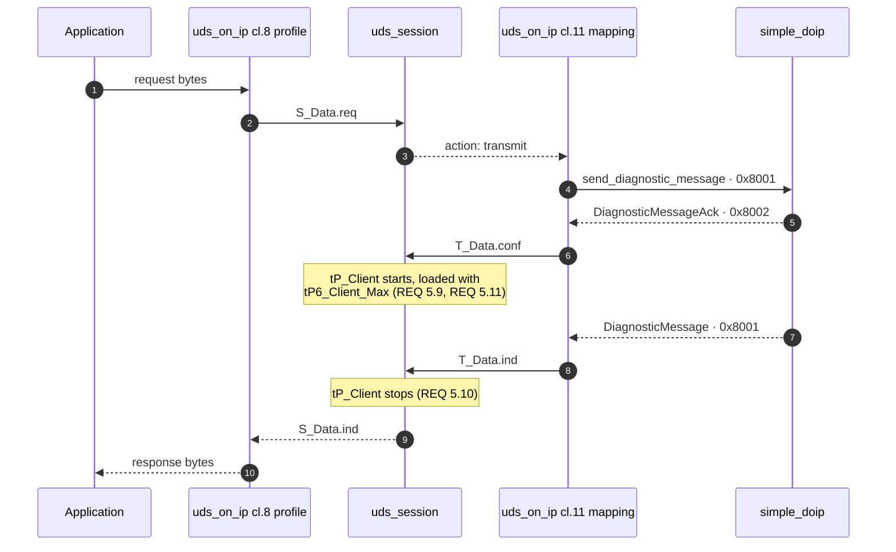
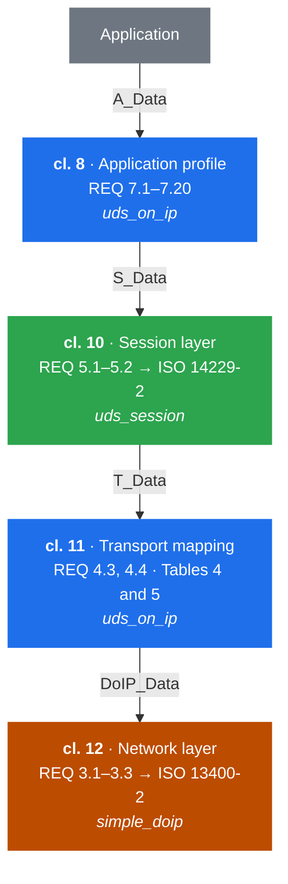
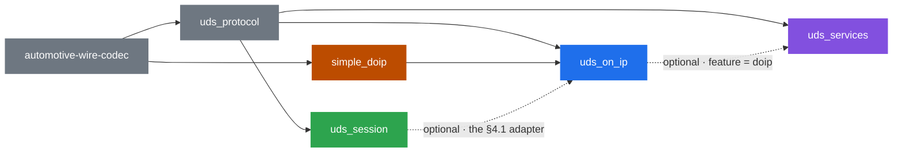
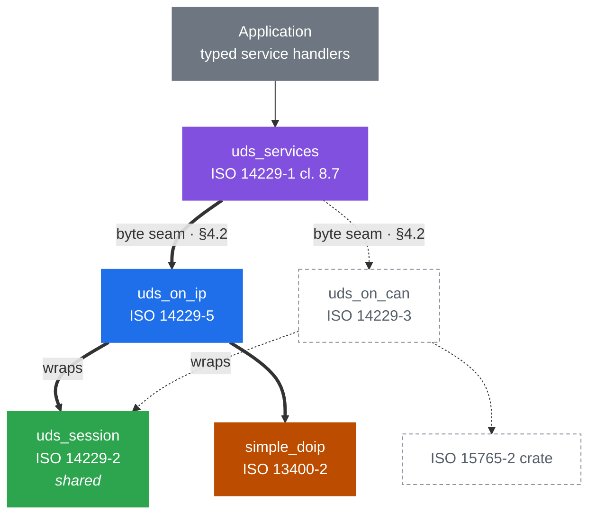

# Architecture

This document describes the **proposed** layout of the MicroVision automotive
diagnostics stack, and `uds_on_ip`'s place in it. It is a design document, not a
description of the code as it stands: `uds_on_ip` today predates most of what is
written here, and [§9](#9-gap-analysis-uds_on_ip-as-it-stands-today) records the
distance between the two.

It exists so that `uds_session`, `uds_services`, and `uds_on_ip` can be designed
in parallel against one agreed set of boundaries.

> **Status: prototype-phase artifact.** Every crate in this stack is intended to
> flow through the same process — requirements, then architecture, in sequence —
> with a prototype preceding both to retire technical risk. This document belongs
> to the prototype phase. It is *not* the SWE.2 architecture, it carries no
> requirement IDs, and the architecture produced by that process supersedes it
> rather than inheriting from it.
>
> The discipline that makes a prototype-first flow sound is that the requirements
> are authored **from the standards, not from the prototype**. A requirement set
> fitted to what the prototype happens to do will agree with the code by
> construction, and the gap-closing step will find nothing — which is the failure
> mode this ordering exists to prevent. Read what follows as evidence about what
> is *buildable*, never as evidence about what is *required*.

> **Spec citations.** A numbered locator appears here only if it was checked
> against a copy of the standard. Every one in this document was verified on
> 2026-09-10; two needed non-obvious lookups, because the PDF-to-markdown
> conversion splits `REQ 4.4` across a table cell and line-breaks `REQ 5.9`'s
> heading. If you cannot check a citation, delete it rather than soften it.
>
> This repository contains no copy of any ISO standard, and the standards
> remain ISO's; nothing here reproduces their text at length.

---

## 1. The organising idea

ISO 14229 is not one standard but a series, and it is already layered. The
stack mirrors that layering one crate per document, so that each crate's scope
question — "does this belong here?" — is answered by asking which document
specifies the behaviour.

The payoff is reuse. A session layer that reads no clock and calls no transport
serves CAN, DoIP, K-line and simulation alike; a service dispatcher that knows
how to fetch a data identifier has nothing to say about IP. Only the crates that
name a transport are bound to one.

## 2. The standards and the crate map

| Standard | Scope | Crate |
| --- | --- | --- |
| ISO 14229-1:2020 cl. 8.7 | Server response implementation rules — dispatch, NRC selection | **`uds_services`** *(proposed)* |
| ISO 14229-1:2020 cl. 7, 10–15 | Diagnostic service message definitions | **`uds_protocol`** |
| ISO 14229-2:2021 | Session layer services — `S_Data`, `tP_Client`, `tS3` | **`uds_session`** |
| ISO 14229-5:2022 | UDSonIP application profile; `T_Data` ↔ `DoIP_Data` mapping | **`uds_on_ip`** |
| ISO 13400-2:2019 | DoIP — framing, `DoIP_Data`, routing activation | **`simple_doip`** |
| — | Zero-copy `no_std` codec traits | **`automotive-wire-codec`** |

ISO 14229-5 clause 7 enumerates its own content as a table of REQ numbers, and
that table is the definition of `uds_on_ip`'s scope. Anything not in it belongs
to another crate.

## 3. Layer responsibilities

Each subsection states what a crate owns and — more usefully — what it must
*not* acquire.

### 3.1 `simple_doip` — ISO 13400-2

Owns DoIP framing, the TCP/UDP sockets, routing activation, alive-check, vehicle
identification, and the `DoIP_Data.req/.ind/.conf` primitives.

**Should not know what a UDS message means.** Its `DiagnosticMessage` treats
the payload as an opaque byte string, and that is the property that keeps it
reusable.

**This does not hold today.** `src/bare_metal_entity.rs` is production code and
exports `UDS_RESP_CAP`, `uds_resp_buf`, and
`on_uds_request: fn(&[u8], &mut [u8]) -> i32` — a byte-level UDS request
callback. That is the same server seam [§4.2](#42-handler-seam--uds_services--uds_on_ip)
assigns to `uds_on_ip`, already shipping one layer down.

Two server seams a layer apart is a real collision, not a cosmetic one, and this
document does not resolve it. Either the bare-metal entity's callback is the
canonical server seam and `uds_on_ip`'s is redundant for `no_std` targets, or it
is a bare-metal-only convenience that should be documented as not composing with
the `uds_services` path. Deciding that is a prerequisite for the server role,
not a detail of it.

A consequence worth stating plainly: ISO 13400-2:2019 defines payload types
`0x8001`–`0x8003` only. The periodic-response payload type `0x8004` is
introduced by ISO 14229-5, so it is **not** `simple_doip`'s to name.

It also does not currently reach `uds_on_ip`. `PayloadType::Reserved(u16)`
names the type but `Payload::decode` rejects it with `UnsupportedPayloadType`,
and the client's public surface is `send_diagnostic_message` /
`receive_diagnostic_response`, so a reserved payload type never reaches a
caller. Surfacing `0x8004` requires a `simple_doip` API change and is a
**prerequisite**, recorded in [§9](#9-gap-analysis). It needs no UDS semantics
upstream — only a way to deliver an unmodelled payload type's bytes.

### 3.2 `uds_protocol` — ISO 14229-1 messages

Owns the encode/decode of every diagnostic service message, built on
`automotive-wire-codec`'s borrowed-first traits. `Request<'a>` and `Response<'a>`
borrow from the caller's buffer.

**Must not acquire dispatch, policy, or session state.** It is a codec. The
absence of any handler trait in `src/services/` today is a property to preserve,
not an omission to fix.

### 3.3 `uds_session` — ISO 14229-2

Owns the session layer: the `S_Data` primitives, the `tP_Client` timer, the
`tS3` timers, and response-pending (NRC `0x78`) handling. Sans-io: it reads no
clock and touches no transport, taking a caller-supplied monotonic millisecond
timestamp and returning actions to drain.

**Must not learn which transport it is running over.** ISO 14229-2:2021 9.1.2
splits `tP_Client`'s reload parameters four ways depending on whether the
transport offers a `T_DataSOM.ind` primitive. The session layer deliberately
does not distinguish the cases: it holds a *default* and an *enhanced* reload
parameter, and the transport-binding layer decides which pair those are.

### 3.4 `uds_on_ip` — ISO 14229-5

Owns four things:

1. **Timing parameter supply.** DoIP has no `T_DataSOM.ind`, so `uds_on_ip`
   supplies `tP6_Client_Max` / `tP6*_Client_Max` as the session layer's default
   and enhanced reload parameters (ISO 14229-2:2021 REQ 5.11).
2. **Primitive adaptation.** The `T_PDU` ↔ `DoIP_PDU` parameter mapping
   (ISO 14229-5:2022 REQ 4.3, REQ 4.4, Tables 4 and 5). Most importantly it
   derives `T_Data.conf` from the DoIP **acknowledgement** (`0x8002`/`0x8003`),
   not from the act of sending — because `tP_Client` starts on `T_Data.conf`
   (ISO 14229-2:2021 REQ 5.9).
3. **Channel storage.** `uds_session` requires per-channel timer storage from
   its caller; `uds_on_ip` is that caller and owns the allocation.
4. **The UDSonIP profile.** REQ 7.8–7.11 (TCP close and re-activation around
   DiagnosticSessionControl and ECUReset), REQ 7.16 (`0x8004` periodic
   responses) and REQ 7.17 (periodic record length limit). REQ 7.20 — that
   unsolicited responses must not reset `tS3_Server` — is a constraint this
   crate must *honour* by routing `0x8004` outside the request/response path,
   but the timer it protects belongs to `uds_session` ([§6](#6-timing-ownership)).

**Must not learn what a service is.** No data identifier, routine identifier, or
service-specific policy belongs here. Its server-side interface is a byte seam.

### 3.5 `uds_services` — ISO 14229-1 cl. 8.7 *(proposed)*

Owns the ergonomic layer: per-service handler traits, the dispatch table, and
the negative-response rules of clause 8.7 — service not supported, sub-function
not supported, request out of range, and the session and security gating that
produce `0x7E` and `0x33`.

**Must not name a transport.** It receives session and security state as
parameters rather than depending on `uds_session`, and it reaches a transport
only through an optional, feature-gated integration ([§4.3](#43-transport-integration)).

## 4. The seams

Three interfaces hold the stack together. Each is designed so that either side
can be built before the other exists.

### 4.1 Session seam — `uds_on_ip` ⇄ `uds_session`

Bidirectional, because of the sandwich in [§8.1](#81-protocol-layering):
`uds_on_ip` pushes `S_Data.req` **down** from the application profile, and feeds
`T_Data.conf` / `T_Data.ind` **up** from the transport mapping. Both edges
belong to `uds_on_ip`, which is what a sans-io session layer requires of its
caller.

**Where the trait lives, precisely.** `SessionLayer` is declared *in
`uds_on_ip`*. `uds_session` does not implement it and does not depend on this
crate — a session layer that knew its transport binding would defeat its own
reason for existing. Instead `uds_on_ip` ships an adapter type that implements
`SessionLayer` over `uds_session`'s concrete API, behind an optional feature.

That keeps the Cargo graph acyclic and preserves "swap without a public API
change", but it does **not** mean the two crates are independent: shipping the
adapter is a real dependency on `uds_session`, and until then `uds_on_ip` runs
its own interim implementation of this trait. Only the *development* of the two
is independent.

The feature gate is load-bearing rather than stylistic. `uds_session` is a
private repository (see [§12](#12-distribution-constraints)), so a
customer-facing `uds_on_ip` cannot depend on it unconditionally.

```rust
pub trait SessionLayer {
    fn s_data_req(&mut self, now_ms: u32, ch: ChannelId, ai: Ai, data: &[u8])
        -> Result<(), SError>;
    fn t_data_conf(&mut self, now_ms: u32, ch: ChannelId, result: TResult);
    fn t_data_ind(&mut self, now_ms: u32, ch: ChannelId, data: &[u8]);
    fn poll(&mut self, now_ms: u32) -> Option<SessionAction<'_>>;

    /// When this layer next needs waking, so the driver can sleep instead of
    /// spinning. `None` means no timer is armed.
    fn next_deadline_ms(&self) -> Option<u32>;
}
```

Three properties of this signature that are easy to get wrong:

- **`now_ms` wraps.** A `u32` millisecond count rolls over at ~49.7 days, so
  every comparison must be wrapping-difference arithmetic, never `<`. ISO
  14229-2 fixes the unit; the width is this seam's choice, and the wrap is the
  price of not requiring a 64-bit clock on a bare-metal target.
- **`poll` borrows `&mut self`**, so an action cannot be held while feeding the
  layer more input. A driver must fully consume each action before polling
  again — actions are drained one at a time, never collected.
- **`next_deadline_ms` is not optional.** Without it a sans-io layer gives the
  caller no way to know when to wake, and the driver has no choice but to
  busy-poll.

`Ai` carries the ISO 14229-2 addressing triple — source address, target address,
and target address type (physical or functional). A `ChannelId` names one
logical communication channel; ISO 14229-2:2021 9.6 Table 7 allocates a
`tP_Client` timer per channel, physical and functional alike.

### 4.2 Handler seam — `uds_services` → `uds_on_ip`

`uds_on_ip`'s server side accepts a byte-level handler and never inspects what
flows through it.

```rust
pub trait RequestHandler {
    fn handle(&mut self, ctx: &Ctx, request: &[u8], out: &mut impl Writer) -> Outcome;
}
```

`Ctx` carries the active session and security level — state `uds_on_ip` learns
from the session layer and passes through without interpreting.

`out` is a generic parameter, not `dyn`, so a response needs no allocation to
return. That costs object safety: there is no `Box<dyn RequestHandler>`, and a
server driver is generic over `H: RequestHandler` instead. For a crate that must
build without `alloc`, where boxing is unavailable anyway, that is the right
trade — but it is a deliberate one.

**This trait belongs to `uds_on_ip`, not to `uds_services`.** A byte seam is
necessarily transport-shaped: it is where a binding hands off. Each binding
declares its own, and `uds_services` implements whichever one its enabled
feature selects. [§4.3](#43-transport-integration) says what `uds_services`
owns instead.

### 4.3 Transport integration

`uds_services` owns the **typed service traits** — the per-service handlers, the
identifier associated types, the clause 8.7 dispatch. It does not own the byte
seam, which is per-binding ([§4.2](#42-handler-seam--uds_services--uds_on_ip)).
What it provides per transport is the adapter between the two, behind an
optional feature, which keeps the dependency edge pointing one way and leaves
`uds_on_ip` ignorant of services.

```toml
# uds_services/Cargo.toml
[features]
doip  = ["dep:uds_on_ip"]
# docan = ["dep:uds_on_can"]   # later, same shape
```

## 5. Where manufacturer-specific types enter

Data identifiers, routine identifiers, and most DTCs are vehicle-manufacturer
specific — ISO 14229-1 fixes ranges and a small set of standardised values, not
the catalogue. The library therefore cannot own those enumerations. The
application supplies them as associated types:

```rust
pub trait UdsServer {
    type Did:  DataIdentifier;      // application's enum
    type Rid:  RoutineIdentifier;
    type Sess: SessionType;
}

pub trait ReadDataByIdentifier: UdsServer {
    fn read(&mut self, did: Self::Did, out: &mut impl Writer) -> Result<(), Nrc>;
}
```

This is what makes the compiler the completeness check the design is aiming for.
Adding a variant to the application's `Did` enum breaks its own exhaustive
`match`, so a newly defined identifier cannot silently go unhandled. A service
the application does not implement at all answers `serviceNotSupported`
automatically.

Open design question, tracked in `uds_services` rather than here: whether
per-service traits plus a `uds_server! { .. }` assembly macro is worth a
proc-macro dependency, versus one trait whose default methods return
`serviceNotSupported`. The macro extends the compile-time completeness signal
from the identifier level up to the service level.

## 6. Timing ownership

Timers are the easiest thing to duplicate across layers by accident, so
ownership is stated explicitly.

| Timer | Owner | Notes |
| --- | --- | --- |
| `tP_Client` | `uds_session` | One per logical communication channel, physical and functional alike (ISO 14229-2:2021 REQ 5.26, Table 7). Starts on `T_Data.conf`, stops on `T_Data.ind` (REQ 5.9, REQ 5.10). |
| default / enhanced reload values | `uds_on_ip` | `tP6_Client_Max` / `tP6*_Client_Max`, because DoIP has no `T_DataSOM.ind` (REQ 5.11). |
| `tP3_Client_Phys`, `tP3_Client_Func` | `uds_session` | One per physical and per functional channel respectively (ISO 14229-2:2021 REQ 5.26, Table 7). Minimum spacing before the next request when none is required. |
| `tS3_Client`, `tS3_Server` | `uds_session` | One `tS3_Server` per server; a client needs one per point-to-point communication (ISO 14229-2:2021 REQ 5.26, Table 8). |
| `tP2_Server`, `tP2*_Server` | `uds_session` | ISO 14229-2 timers, so they belong with the other session timers, not with the service that happens to be slow. See the response-pending note below. |
| `tP4_Server` | `uds_services` | Not a timer to run: ISO 14229-2 types it a performance requirement on the application. |
| TCP connect / routing-activation timeouts | `simple_doip` | Transport-level, no UDS meaning. |

### 6.1 Who emits response-pending

Server-side NRC `0x78` had no owner in the first draft of this document, and it
is the one server-side timing rule that cannot be got wrong: if the server will
not answer within `tP2_Server`, it must emit response-pending *before* that
timer expires, which then grants it `tP2*_Server`.

The decision cannot sit with `uds_services`. A handler that is still working is
by definition not returning, so it cannot also be watching a clock, and the
clock in question is an ISO 14229-2 timer.

So: **`uds_session` owns the timer and decides**, emitting a send-response-pending
action; `uds_on_ip` transmits it. `uds_services` is not consulted and does not
need to be — it is simply still running.

Two consequences for the driver. Dispatch to a handler must not block the loop
that drains session actions, or the timer cannot fire while a handler is
executing. And [§4.2](#42-handler-seam--uds_services--uds_on_ip)'s
`RequestHandler` is synchronous, so a slow handler must run somewhere the driver
can continue past — which is a constraint on the server driver that this
prototype has not yet designed.

## 7. Data flow

### 7.1 Client, physically addressed

This is the canonical path, and it shows exactly where `uds_on_ip` meets
`simple_doip`. Both `uds_on_ip` participants are the same crate — the profile
half above the session layer, the mapping half below it.



The step worth dwelling on is 5→6: `tP_Client` starts on the
**acknowledgement**, not on the send. Getting that wrong would shorten every
timeout in the stack by one network round trip.

**The shipping implementation already gets this right**, and an earlier draft of
this document claimed otherwise. `simple_doip`'s `send_diagnostic_message` parks
an await that resolves only when the acknowledgement arrives, and `uds_on_ip`
takes its response timestamp after that await returns. The timing is correct.

What is missing is the *primitive*, and that is the real gap. Send and confirm
are fused into a single future, so there is no `T_Data.conf` to name, no
separate timestamp to attach to it, and a negative acknowledgement surfaces as a
send **error** rather than as `T_Data.conf(negative)`. A session layer that
wants to distinguish "the peer refused the message" from "the socket broke"
cannot, and the drawing above cannot be implemented as drawn until it can.

Also undocumented in the shipping code: the response timestamp is reset on every
reconnect, so a request that survives a reconnect gets a fresh `tP_Client`
rather than the remainder of its original one. That is a deliberate deviation
and should be a requirement with a rationale, not an implementation detail.

An NRC `0x78` arriving at step 8 reloads the timer with the enhanced parameter
rather than completing the request.

### 7.2 Other paths

**Client, functionally addressed.** Identical until the response: a functional
request is answered by *several* servers behind the gateway. `tP_Client` reloads
on each response, and its expiry — not a single response — is the signal that no
more are coming (ISO 14229-5:2022 Figure 8). A functional request therefore
yields a stream of responses, not one.

**Client, session change or ECU reset.** The server closes the TCP connection
after its positive response and before executing the service. `uds_on_ip`
establishes a new connection *and repeats routing activation* before diagnostic
communication continues (REQ 7.8–7.11). This is specified behaviour, not error
recovery, and should be modelled as such.

**Server.** A diagnostic message arrives, becomes `T_Data.ind`, and is offered to
the session layer, which decides whether it is admissible. Admitted requests
reach the `RequestHandler` seam; `uds_services` dispatches to the application's
typed handler and encodes the response, which returns down the same path.

**Periodic responses.** Payload type `0x8004` bypasses the request/response
correlation path entirely and is surfaced out-of-band, without resetting
`tS3_Server` (REQ 7.16, REQ 7.20).

## 8. Two different graphs

The protocol layering and the Cargo dependency graph are not the same shape, and
conflating them is the easiest way to misread this design.

### 8.1 Protocol layering

ISO 14229-5 clause 7 numbers its requirements by OSI layer, descending — which
is why the REQ numbers look arbitrary until the scheme is visible. `REQ 7.x` is
the application layer, `REQ 5.x` the session layer, `REQ 4.x` the transport
layer, `REQ 3.x` the network layer.



The two blue boxes are the same crate. That is the sandwich.

**`uds_on_ip` sits both above and below `uds_session`.** The application-profile
half is above it; the transport adaptation half is below it. `uds_on_ip` wraps
the session layer rather than stacking on top of it, and drives it from both
edges — pushing `S_Data.req` down on the outbound path, feeding `T_Data.conf`
and `T_Data.ind` up from the transport. A sans-io session layer supports this
naturally, because the caller owns both edges by construction.

Note also that the A_Data ↔ S_Data parameter mapping is specified by ISO
14229-2 clause 7, not by -5. That mapping is `uds_session`'s; `uds_on_ip` meets
it at the S_Data boundary rather than reimplementing it.

### 8.2 Cargo dependency graph

Arrows point from a crate to the crates that depend on it, so reading left to
right is also publication order.



Acyclic because `uds_session` never depends back, even though `uds_on_ip`
surrounds it: the `SessionLayer` trait is declared in `uds_on_ip` and the
adapter onto `uds_session` lives there too ([§4.1](#41-session-seam--uds_on_ip--uds_session)).
Both dotted edges are optional features, which is what lets this crate ship
without a private dependency ([§12](#12-distribution-constraints)).

### 8.3 What a transport swap replaces

The sandwich in §8.1 invites a reasonable question: if `uds_on_ip` surrounds the
session layer, what does it mean to target a different transport?

The answer is that a transport binding is not a layer swapped *within* a stack.
It is a complete A_Data↔wire path wrapped around the shared session core, and
swapping means replacing the binding together with its transport — two crates
out, two in — while the session, message, and service crates stay put.

Thick edges are the stack that exists today; dotted edges are the CAN binding
as it would attach.



Each binding wraps the same `uds_session` the same way, and neither knows the
other exists. This is why the session layer must never learn its transport: it
is the piece that survives the swap. `uds_protocol` likewise feeds both.

For application code the swap point is the byte seam of §4.2, not `uds_on_ip`'s
own API — a typed server implements `uds_services` traits and reaches a binding
through the feature gate of §4.3.

**The limit, stated plainly.** The diagnostic *conversation* is portable;
connection setup is not, and no API should pretend otherwise. DoIP has TCP
connections, routing activation, vehicle identification and alive-check; CAN has
none of these. A `connect()` that looked identical across both would be lying,
and the lie would surface the moment someone needed a routing activation type or
a CAN identifier layout. The portable surface is defining identifiers,
implementing handlers, and exchanging requests. Establishing and configuring the
link is a real seam in the application, and the architecture says so rather than
papering over it.

*(ISO 14229-3 and ISO 15765-2 are named here as the CAN analogues by structure.
Neither is held in the spec set this document was checked against, so no clause
numbers are cited for them — see the note on citations at the top.)*

### 8.4 Publication order

There are **two tracks**, with different constraints, and conflating them
overstates what is blocking.

**Internal — [INTERNAL_REGISTRY_REDACTED].** An internal registry
(`CARGO_REGISTRY_DEFAULT: "[INTERNAL_REGISTRY_REDACTED]"`) already exists and is what lets the crates
leave `[INTERNAL_PROJECT_REDACTED]`. It has no ordering constraint worth naming: a crate can be
published there as soon as it builds, and `[INTERNAL_PROJECT_REDACTED]` consumes it as a registry
dependency rather than a submodule or a path. This is the track that unblocks
retiring the monorepo, and it is not waiting on anything in the table below.

**Public — crates.io.** This one is strictly ordered, because crates.io accepts
neither git dependencies nor dependencies hosted in another registry: every
dependency must already be on crates.io. So the whole chain must publish
bottom-up, and a crate that is fine internally can still be unpublishable
publicly.

Publishing publicly is not cosmetic. Customers build the SDK from source and
cannot reach an internal registry, which is why the bundle vendors these crates
today ([§12.1](#121-this-crate-ships-to-customers-as-source)). crates.io
publication is what would let it stop.

Current state of the public track:

| Crate | crates.io | Blocker |
| --- | --- | --- |
| `automotive-wire-codec` | 0.3.0 | — |
| `uds_protocol` | 0.0.2 | `main` is at 0.1.0; the release PR has been open since 2026-07-30 |
| `simple_doip` | unpublished | Publication tooling in flight |
| `uds_on_ip` | unpublished | Both of the above |
| `uds_session` | unpublished | Pre-implementation |
| `uds_services` | pre-implementation | — |

## 9. Gap analysis

Verified against `origin/main` on 2026-09-10, not recalled. Each entry names
where it was checked.

### 9.1 Prerequisites — blocking, and not in this crate

- **`0x8004` cannot be received.** `Payload::decode` rejects
  `PayloadType::Reserved(_)` with `UnsupportedPayloadType`
  (`simple_doip/src/messages/payload.rs`), and the async client's public surface
  exposes only diagnostic messages and their acknowledgements. REQ 7.16 and
  REQ 7.20 are unimplementable until `simple_doip` can deliver an unmodelled
  payload type's bytes. No UDS semantics are needed upstream to fix it.
- **The acknowledgement is not a distinct primitive.** Send and confirm are one
  future, so `T_Data.conf` cannot be named or timestamped, and a negative
  acknowledgement arrives as a send error rather than a negative confirm
  ([§7.1](#71-client-physically-addressed)).
- **`0x8003` is never emitted by our own entity.**
  `Message::diagnostic_message_ack` stamps `0x8002` regardless of `ack_code`, a
  known open issue recorded in `simple_doip/src/messages/mod.rs`. Any loop
  involving our entity cannot exercise the acknowledgement discrimination
  §3.4(2) depends on.
- **Two server seams.** `simple_doip`'s bare-metal entity already exposes a UDS
  request callback ([§3.1](#31-simple_doip--iso-13400-2)).

### 9.2 Design gaps in this crate

- **Session logic lives here rather than in `uds_session`** — tester-present
  keepalive, response timing, and NRC `0x78` handling are in `src/client.rs`,
  interim by construction.
- **Functional addressing collapses to a single response**, so the multi-server
  fan-out of ISO 14229-5:2022 Figure 8 cannot be expressed. This is a shape
  change to the public API, not a fix.
- **Timing configuration carries P2-flavoured names** — `response_timeout` and
  `response_pending_timeout` are `tP6_Client_Max` and `tP6*_Client_Max` on DoIP
  (ISO 14229-2:2021 REQ 5.11).
- **`tP3_Client_Phys` / `tP3_Client_Func` are absent** — the minimum spacing
  before a subsequent request when none is required.
- **Reconnection is framed as resilience** rather than as REQ 7.8 / REQ 7.10
  conformance, and the response timer is silently restarted by it
  ([§7.1](#71-client-physically-addressed)).
- **No server role**, and therefore no owner for response-pending
  ([§6.1](#61-who-emits-response-pending)).

### 9.3 Corrected since the first draft

Recorded because this section is the one a reader is most likely to trust, and
it was wrong twice.

- **Dependencies are current.** An earlier draft claimed the crate was ~101
  commits behind `simple_doip` and ~242 behind `uds_protocol`, and did not
  compile. Both are false: `origin/main` pins the current head of each, builds
  clean, and the migration away from the owned generic abstraction
  (`ProtocolRequest`, `ProtocolResponse`, `UdsSpec`, `DiagnosticDefinition`) has
  already happened. Those counts came from a stale local checkout.
- **`tP_Client` already starts on the acknowledgement.** An earlier draft
  claimed it started on the send and built a note in §7.1 on top of that. The
  real gap is the missing primitive, above.

## 10. Traceability

`uds_session` has already settled the apparatus, and `uds_on_ip` should adopt it
rather than invent a second one. The shape, for reference while designing:

- **Requirements are sphinx-needs directives**, one `llr` per requirement,
  carrying `:id:`, `:status:`, `:integrity_level:`, `:target_level:`,
  `:origin:`, `:source:`, and `:tags:`.
- **`:source:` holds the spec locators**, semicolon-separated — the same format
  used in prose throughout this document, so citations here port directly into
  requirements without rewriting.
- **`:origin:` classifies provenance** — transcribed from a standard, or
  derived. Derived requirements carry the reasoning that produced them, because
  that reasoning cannot be reconstructed later.
- **`impl` and `test` needs are generated from source annotations**, so code and
  tests link back to requirement IDs rather than being matched up by hand.
- **`needs.json` is a published interface**, keyed by `version` and consumed
  across repositories through `needs_external_needs`.

Two consequences for this crate specifically:

1. It needs its own ID prefix. `uds_session` pins
   `^UDSS_LLR_\d{4}$|^UDSS_(IMPL|TEST)_[A-Z0-9_]+$`; `uds_on_ip` will need an
   equivalent regex over its own namespace.
2. The seams in [§4](#4-the-seams) should ultimately be expressed as *links* to
   `uds_session`'s requirement IDs, not as restatements of them. A restated
   requirement is a requirement that can drift. Consuming `uds_session`'s
   `needs.json` is what makes the seam checkable rather than aspirational.

## 11. `no_std` scope

`simple_doip` names a bare-metal diagnostic ECU as its forcing function and
`uds_protocol` is `no_std`; the shipping `uds_on_ip` is `tokio` plus
`async-trait`, so the question does not answer itself.

The position taken here: **the core is `no_std` and alloc-free; only the drivers
need `std`.** Addressing, the session seam, the transport mapping, the profile
and the handler seam allocate nothing and build for a `*-none` target. Responses
borrow a caller-supplied receive buffer and a handler writes into a
caller-supplied sink, so no public type carries a `Vec` or a `String`.

This is designed in rather than deferred because it cannot be retrofitted: the
signatures that make an API alloc-free are the same signatures callers depend
on. The first driver happens to sit on `tokio`, but a bare-metal driver presents
the same shape, which makes gaining one additive.

## 12. Distribution constraints

Two constraints that change what "publication order" in
[§8.4](#84-publication-order) means. Both bind before any of the design above
can ship. Verified 2026-09-10 against fetched `origin/main` refs, not local
checkouts.

### 12.1 This crate ships to customers as source

`[INTERNAL_PROJECT_REDACTED]`'s `[INTERNAL_PATH_REDACTED]/sdk.toml` lists `crates/uds_on_ip` under
`[component.diagnostics]`, alongside `uds_protocol` and `simple_doip`. The
manifest's own comment gives the reason: all three are workspace path deps of
`[INTERNAL_COMPONENT_REDACTED]`, so the bundle must carry them or the copied
manifests dangle. The SDK is built from source by consumers.

Three things follow:

- The redesign in this document is a **breaking change to shipped code**, and
  no migration path is stated anywhere. One is owed before it lands.
- [§9](#9-gap-analysis) is a public defect list on a customer-facing crate.
  That may still be right — the defects are real and concealing them serves
  nobody — but it should be a decision, not an accident.
- This document ships with the crate. That is why the citation note at the top
  is one line rather than an argument about policy.

### 12.2 Two copies exist, and the split-out is in progress

`crates/uds_protocol` and `crates/simple_doip` are git submodules of `[INTERNAL_PROJECT_REDACTED]`
pointing at their standalone repositories. `crates/uds_on_ip` is not — it is a
plain directory in `[INTERNAL_PROJECT_REDACTED]`'s tree, so this repository is a second copy of it.

**This is transitional.** The crates are being removed from `[INTERNAL_PROJECT_REDACTED]` and consumed
from an internal [INTERNAL_REGISTRY_REDACTED] registry instead, retiring the monorepo. **This
repository is canonical**; `[INTERNAL_PROJECT_REDACTED]`'s in-tree copy is the one going away.

Until that removal lands there is no mechanism to notice divergence — a
submodule pins a revision, an in-tree copy drifts silently — and the two are
byte-identical today only because nobody has changed one without the other.
`[INTERNAL_PROJECT_REDACTED]`'s CI builds its copy (`-p uds_on_ip`) and filters on
`crates/uds_on_ip/**`; nothing fetches or mirrors. So the ordering matters:
the prototype is what first diverges them, and reconciling two histories
afterwards costs more than removing the copy first.

### 12.3 `uds_session` is private

Verified via the GitHub API: `luminartech/uds_session` is a private repository.
A customer-facing crate cannot take an unconditional dependency on a private,
unpublished crate, which is why the adapter in
[§4.1](#41-session-seam--uds_on_ip--uds_session) is behind an optional feature.
Either `uds_session` is published before `uds_on_ip` depends on it by default,
or the default build keeps the interim in-crate session implementation.

## 13. Invariants to preserve

1. A crate's scope is decided by which standard specifies the behaviour, not by
   convenience.
2. `simple_doip` never learns what a UDS message means. **Currently violated**
   by the bare-metal entity's UDS callback ([§3.1](#31-simple_doip--iso-13400-2));
   listed as an invariant to restore, not one that holds.
3. `uds_protocol` stays a codec — no dispatch, no policy, no session state.
4. `uds_session` never learns its transport, and never reads a clock.
5. `uds_on_ip` never learns what a service is.
6. `uds_services` never names a transport outside a feature gate.
7. Every timer has exactly one owner ([§6](#6-timing-ownership)), and every
   timing rule has exactly one decider ([§6.1](#61-who-emits-response-pending)).
8. Spec locators are verified or absent — no third option, and no argument
   about the policy in place of checking.
