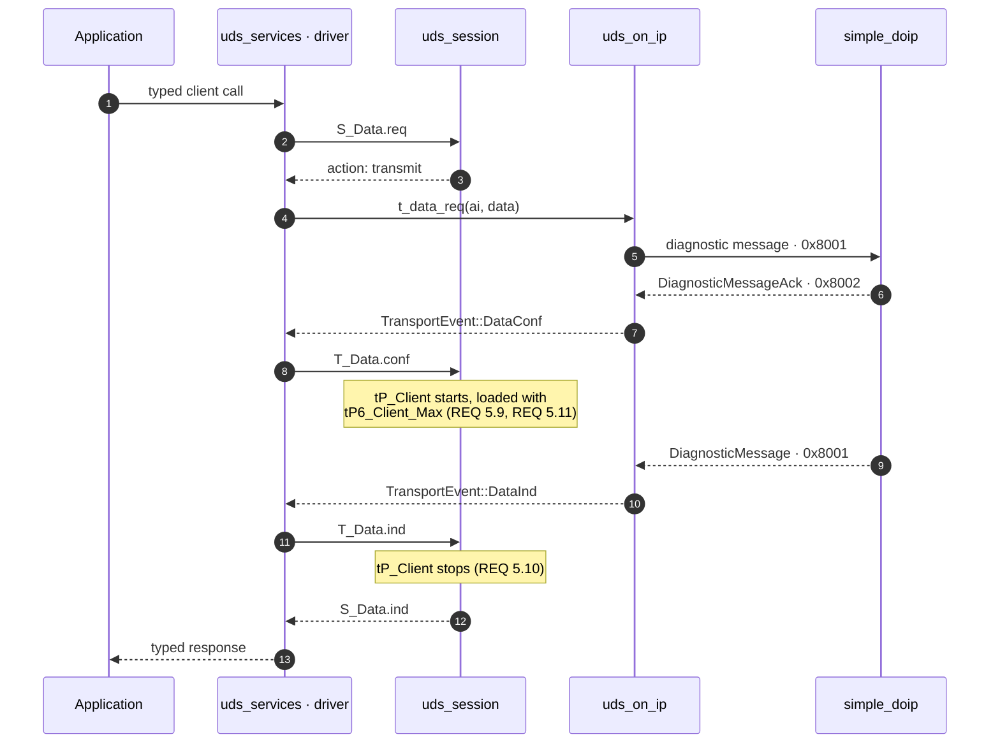
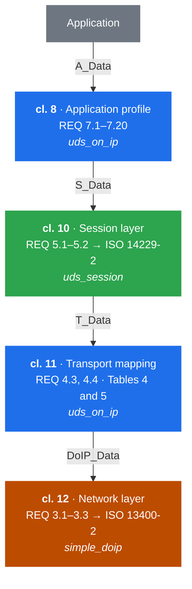
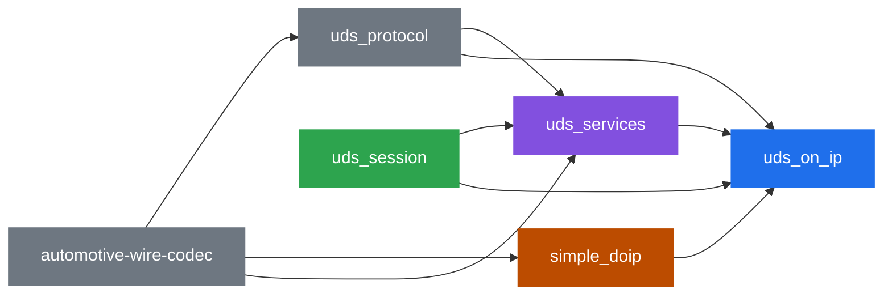
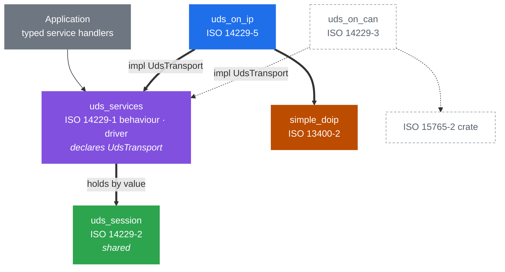

# Architecture

This document describes the **proposed** layout of the MicroVision automotive
diagnostics stack, and `uds_on_ip`'s place in it. It is a design document rather
than a description of the code, and [§9](#9-gap-analysis) records the distance
between the two.

It describes the design as it stands; the repository's history records how it
got there.

It exists so that `uds_session`, `uds_services`, and `uds_on_ip` can be designed
in parallel against one agreed set of boundaries.

> **Status: prototype-phase artifact.** Every crate in this stack is intended to
> flow through the same process — requirements, then architecture, in sequence —
> with a prototype preceding both to retire technical risk. This document belongs
> to the prototype phase. It is *not* the SWE.2 architecture, it carries no
> requirement IDs, and the architecture produced by that process supersedes it
> rather than inheriting from it.
>
> The discipline that makes a prototype-first flow sound is that the requirements
> are authored **from the standards, not from the prototype**. A requirement set
> fitted to what the prototype happens to do will agree with the code by
> construction, and the gap-closing step will find nothing — which is the failure
> mode this ordering exists to prevent. Read what follows as evidence about what
> is *buildable*, never as evidence about what is *required*.

> **Spec citations.** This crate is built against **ISO 14229-5:2022**: a
> clause, table, figure or requirement cited with no document named is that
> one's, and a citation of any other document names it and its edition. A
> numbered locator appears here only if it was checked against a copy of the
> standard. Every one in this document was verified on
> 2026-09-10; two needed non-obvious lookups, because the PDF-to-markdown
> conversion splits `REQ 4.4` across a table cell and line-breaks `REQ 5.9`'s
> heading. If you cannot check a citation, delete it rather than soften it.
>
> Re-checked on 2026-10-06 for the sections changed that day: ISO 14229-5:2022
> REQ 7.7–7.20 and clause 8.8, and ISO 13400-2:2019 REQ 4.DoIP-002,
> REQ 3.DoIP-092, REQ 3.DoIP-127, REQ 7.DoIP-072 and REQ 7.DoIP-073. One claim
> in [§3.6](#36-when-and-what) is carried without a locator: that closing a TCP
> connection is an ISO 13400-2 mechanism.
>
> This repository contains no copy of any ISO standard, and the standards
> remain ISO's; nothing here reproduces their text at length.

> **This document is provisional.** Formal architecture and requirements for
> this stack are authored in sphinx-needs under `docs/architecture/` and
> `docs/requirements/`. That set will cover the whole stack; so far its
> architecture covers `uds_services`, so for the rest of the stack, and for
> this crate, this file is still the record, cut down to what checks out
> against the code until its content moves there.

---

## 1. The organising idea

ISO 14229 is not one standard but a series, and it is already layered. The
stack mirrors that layering one crate per document, so that each crate's scope
question — "does this belong here?" — is answered by asking which document
specifies the behaviour.

The payoff is reuse. A session layer that reads no clock and calls no transport
serves CAN, DoIP, K-line and simulation alike; a service dispatcher that knows
how to fetch a data identifier has nothing to say about IP. Only the crates that
name a transport are bound to one.

## 2. The standards and the crate map

| Standard | Scope | Crate |
| --- | --- | --- |
| ISO 14229-1:2020 (behaviour) | Dispatch and NRC selection, incl. the cl. 8.7 response rules | **`uds_services`** |
| ISO 14229-1:2020 cl. 7, 10–15 | Diagnostic service message definitions | **`uds_protocol`** |
| ISO 14229-2:2021 | Session layer services — `S_Data`, `tP_Client`, `tS3` | **`uds_session`** |
| ISO 14229-5:2022 | UDSonIP application profile; `T_Data` ↔ `DoIP_Data` mapping | **`uds_on_ip`** |
| ISO 13400-2:2019 | DoIP — framing, `DoIP_Data`, routing activation | **`simple_doip`** |
| — | Zero-copy `no_std` codec traits | **`automotive-wire-codec`** |

ISO 14229-5 clause 7 enumerates its own content as a table of REQ numbers, and
that table is the definition of `uds_on_ip`'s scope. Anything not in it belongs
to another crate.

## 3. Layer responsibilities

Each subsection states what a crate owns and — more usefully — what it must
*not* acquire.

### 3.1 `simple_doip` — ISO 13400-2

Owns DoIP framing, the TCP/UDP sockets, routing activation, alive-check, vehicle
identification, and the `DoIP_Data.req/.ind/.conf` primitives.

**Should not know what a UDS message means.** Its `DiagnosticMessage` treats
the payload as an opaque byte string, and that is the property that keeps it
reusable.

**This does not hold today.** `src/bare_metal_entity.rs` is production code and
exports `UDS_RESP_CAP`, `uds_resp_buf`, and
`on_uds_request: fn(&[u8], &mut [u8]) -> i32` — a byte-level UDS request
callback. That is a server seam one layer below the one `uds_services` declares
([§4.1](#41-transport-seam--uds_services--uds_on_ip)), and it ships today.

Two server seams a layer apart is a real collision, not a cosmetic one, and this
document does not resolve it. Either the bare-metal entity's callback is the
canonical server seam for `no_std` targets and the `uds_services` path is not
for them, or it is a bare-metal-only convenience that should be documented as
not composing with that path. Deciding it is a prerequisite for the server role,
not a detail of it.

The connection seam of [§4.2](#42-connection-seam--uds_on_ip--simple_doip) does
not pass through it: `simple_doip::service::DiagnosticEntity` is declared beside
the bare-metal entity, and carries no dispatch of its own.

### 3.2 `uds_protocol` — ISO 14229-1 messages

Owns the encode/decode of every diagnostic service message, built on
`automotive-wire-codec`'s borrowed-first traits. `Request<'a>` and `Response<'a>`
borrow from the caller's buffer.

**Must not acquire dispatch, policy, or session state.** It is a codec. The
absence of any handler trait in `src/services/` today is a property to preserve,
not an omission to fix.

### 3.3 `uds_session` — ISO 14229-2

Owns the session layer: the `S_Data` primitives, the `tP_Client` timer, the
`tS3` timers, and response-pending (NRC `0x78`) handling. Sans-io: it reads no
clock and touches no transport, taking a caller-supplied monotonic millisecond
timestamp and returning actions to drain.

**Must not learn which transport it is running over.** ISO 14229-2:2021 9.1.2
splits `tP_Client`'s reload parameters four ways depending on whether the
transport offers a `T_DataSOM.ind` primitive. The session layer deliberately
does not distinguish the cases: it holds a *default* and an *enhanced* reload
parameter, and the transport-binding layer decides which pair those are.

### 3.4 `uds_on_ip` — ISO 14229-5

Owns three things:

1. **Timing parameter supply.** DoIP has no `T_DataSOM.ind`, so `uds_on_ip`
   supplies `tP6_Client_Max` / `tP6*_Client_Max` as the session layer's default
   and enhanced reload parameters (ISO 14229-2:2021 REQ 5.11). It supplies the
   *values*; `uds_session::Reloads` is the type, and is not redeclared here.
2. **Primitive adaptation.** The `T_PDU` ↔ `DoIP_PDU` parameter mapping
   (ISO 14229-5:2022 REQ 4.3, REQ 4.4, Tables 4 and 5): `T_Data.conf` is
   `DoIP_Data.confirm`, whose `DoIP_Result` becomes the `T_Result`. For a
   tester's request `simple_doip` raises that confirm from the DoIP
   **acknowledgement** (`0x8002`/`0x8003`), not from the act of sending —
   because `tP_Client` starts on `T_Data.conf` (ISO 14229-2:2021 REQ 5.9); for
   an entity's response, which a tester does not acknowledge, from the
   completed write.
3. **The UDSonIP profile.** REQ 7.8–7.11: TCP close and re-activation around
   `DiagnosticSessionControl` and `ECUReset`. The periodic-response
   requirements — REQ 7.7 and REQ 7.16 (payload type `0x8004`) and REQ 7.17
   (record length) — are this crate's too, and are not implemented
   ([§9.2](#92-design-gaps-in-this-crate)). REQ 7.20, that an unsolicited
   response does not reset `tS3_Server`, constrains that send path, but the
   timer it protects belongs to `uds_session` ([§6](#6-timing-ownership)).

**It does not own channel storage.** `uds_session` requires per-channel storage
from its caller, and the caller is `uds_services::Server`, which holds the
session layer by value and the storage with it
(`store: <A::Store as Storage>::EMPTY`).

**Must not learn what a service is.** No data identifier, routine identifier, or
service-specific policy belongs here.

The exception is narrow, forced, and exhaustively listed: clause 8 keys TCP
connection handling on two service identifiers, `DiagnosticSessionControl` and
`ECUReset`, in their request forms, and on `ECUReset`'s positive response. That is not
service *semantics* — it is a clause 8 rule that happens to be keyed on a
service, and the identifiers themselves are derived from `uds_protocol`'s
`UdsServiceType` rather than written here as bytes. See
[§3.6](#36-when-and-what) for why the rule lands here and not one layer up.

### 3.5 `uds_services` — ISO 14229-1's behaviour

Owns the ergonomic layer — per-service handler traits, the dispatch table, and
the negative-response rules of clause 8.7 — **and the driver**. It holds a
`uds_session::Client` or `Server` by value, supplies its inputs, drains its
actions, and calls a transport through the trait it declares.

`UDSS_LLR_0029` fixes the role at creation, so a node acting as both holds two
instances rather than one session object.

**Declares the transport seam, and implements no transport.** `uds_services`
declares `UdsTransport`, `uds_on_ip` implements it, and the Cargo edge runs from
the implementor up to the declarer
([§4.1](#41-transport-seam--uds_services--uds_on_ip)).

**Must not acquire a transport's protocol.** The test is the one that crate
states for itself: nothing in the trait is DoIP-shaped, and a CAN binding
implements the same methods. A fact that only a TCP transport could act on does
not belong on that seam, which is what [§3.6](#36-when-and-what) turns into a
rule.

### 3.6 When and what

Four questions in this stack were argued separately and turned out to be one
question. Stating the rule once means the next one does not have to be.

> **ISO 14229-5 decides *when*. ISO 13400-2 performs *what*.**

- **Reconnect and repeat routing activation** (REQ 7.8, 7.10) — `uds_on_ip`
  sequences it, `simple_doip` performs it. Both requirements put the new
  connection and routing activation before diagnostic communication continues,
  and routing activation is ISO 13400-2's procedure, in which the *client*
  entity sends the request — so a server has nothing to sequence.
- **Close after a positive response** (REQ 7.9, 7.11) — `uds_on_ip` decides,
  `simple_doip` closes. Closing a TCP connection is an ISO 13400-2 mechanism;
  the rule that a close follows *this particular* response is ISO 14229-5's.
  REQ 7.11's close follows every positive `ECUReset` response. REQ 7.9's
  follows a positive `DiagnosticSessionControl` response only where the session
  change disconnects — where the server leaves the software it is running, as
  an application entering its bootloader does — and that fact is the server's
  own, so the server states it and `uds_on_ip` decides what follows.
- **Periodic responses** (REQ 7.7, 7.16) — `uds_on_ip` chooses payload type
  `0x8004`, `simple_doip` sends it. The type is ISO 14229-5's; ISO 13400-2:2019
  stops at `0x8003`. Neither half is built
  ([§9.2](#92-design-gaps-in-this-crate)).
- **Which `tP_Client` reload pair** (REQ 5.11) — `uds_on_ip` chooses,
  `uds_session` runs the timer.

The rule also says what must *not* happen. `uds_services` never decides when a
connection closes: knowing that REQ 7.9 or 7.11 requires one is ISO 14229-5
knowledge, and a "close" flag it set would carry the requirement, not just the
plumbing. What it carries instead is the server's statement that it leaves its
running software after this response — an ISO 14229-1 fact about the server,
true on any transport, from which this crate derives REQ 7.9's close. And
`simple_doip` never recognises a service identifier to decide it for itself —
that is [§13](#13-invariants-to-preserve) invariant 2, already listed as
violated and awaiting restoration.

## 4. The seams

Two interfaces hold this crate in place, one above and one below. A third
thing that looks like a seam is not one, and is described last so it is not
mistaken for one.

Each is declared by the crate that *calls* through it, so the Cargo edge runs
from the implementor to the declarer and the caller never depends on its
callee's choice of binding.

### 4.1 Transport seam — `uds_services` → `uds_on_ip`

`uds_services` declares `UdsTransport` and `TransportEvent`; `uds_on_ip`
implements the trait over DoIP. The dependency edge therefore runs *up*, from
this crate to `uds_services`, which is what keeps a binding additive at the
application: `uds_services` names no transport, so adding a CAN binding requires
no change to it.

```rust
pub trait UdsTransport {
    type Error: core::fmt::Debug;
    const MAX_PDU: usize = usize::MAX;

    fn t_data_req(&mut self, ai: Ai, data: &[u8], after: AfterSend)
        -> impl Future<Output = Result<(), Self::Error>>;
    fn next_event<'b>(&mut self, buffer: &'b mut [u8], deadline: Option<Timestamp>)
        -> impl Future<Output = Result<TransportEvent<'b>, Self::Error>>;

    fn outbound_max(&self) -> Option<usize>;
    fn channel_timing(&self) -> Reloads;
    fn now(&self) -> Timestamp;
}
```

Three properties of this shape are load-bearing:

- **The event borrows the driver's buffer, never the transport.** A
  `TransportEvent<'a>` borrowing `&'a mut self` would keep the transport
  mutably borrowed for as long as the message lived, so a server could never
  answer the request it had just received. Borrowing the `buffer` parameter
  releases `&mut self` when the future completes. A length-plus-buffer shape is
  worse than either: it puts the tie in prose and leaves a length that can
  overstate what was lent.
- **Truncation is a variant, not a flag.** `DataInd { ai, data, .. }` is
  idiomatic destructuring and would silently discard a `truncated` flag,
  leaving a fragment decoded as a whole message. `DataTooLong` cannot be
  absorbed by an arm written for a whole message.
- **The transport's limit is a constant; the server states none.** `MAX_PDU` is
  known when the server is assembled, so `uds_server!` folds it into the
  buffers: `DoIpTransport` states its entity's, and a response that would not
  fit is answered `responseTooLong`. There is deliberately no request limit
  for the transport to enforce. A request longer than the server decodes, but
  one the entity can hold, still reaches the server, truncated, so that it is
  answered in ISO 14229-1's order: an unsupported service `0x11` before a
  wrong length `0x13`. A `DoIP` NACK `0x04` (ISO 13400-2:2019 REQ 7.DoIP-072)
  at the server's decode length would answer the first with the second's
  reason, so the entity's *Max. data size* is what it can hold, and beyond
  that it refuses the frame itself (header NACK `0x02`). This is the answer to
  #41, which asked for the NACK. `outbound_max` is the peer's
  advertised *Max. data size*, which a tester never sends an entity, so
  `DoIpTransport` reports `None`.

**No close and no reconnect, by decision rather than omission.** A server is
reconnected *to* and never reconnects — ISO 14229-5:2022 REQ 7.8 and REQ 7.10
have the connection re-established and routing activated anew, and the client
entity sends the routing activation request — so a `reconnect()` would be a method
the only existing driver must never call. A `close()` would require `uds_services` to
know that REQ 7.9 demands one — see [§3.6](#36-when-and-what) for what it states
instead.

### 4.2 Connection seam — `uds_on_ip` → `simple_doip`

**Built for the server role.** ISO 13400-2 is titled *Transport protocol and
network layer services*; a TCP connection is its subject matter, so the sockets
are `simple_doip`'s and this crate holds none. A socket trait declared here was
considered and rejected: it would have put ISO 13400-2's frame handling in the
wrong crate. `simple_doip::service` declares
the seam with no I/O in it:

- `DiagnosticEntity` — a whole `DoIP` entity, every connection it has
  accepted, behind one event stream. `next_event` reports each
  `DoIP_Data.indication` and `DoIP_Data.confirm` tagged with the
  `ConnectionId` it arrived on; `request` routes a response by its target
  address; `close(connection)` performs the close REQ 7.9 and REQ 7.11
  prescribe — this crate decides *when*, the entity performs *what*.
  `MAX_PDU` is the longest response it sends.
  `DoIpTransport<E: DiagnosticEntity, CONNECTIONS>` drives it and feeds one
  `uds_services::Server`, because the session is the server's, not a
  connection's.
- `DiagnosticConnection` — one connection, as a tester uses it. This crate's
  client role over it is not built yet.

This transport's `CONNECTIONS` must be at least the entity's, the size of
its connection table, reserve socket included (ISO 13400-2:2019 REQ 4.DoIP-002):
the transport remembers which tester arrived on which connection, so that it can
close the right one. `DoIpTransport::new` checks the two at compile time, so the
mismatch cannot reach a running server.

The deadline `next_event` takes, a `simple_doip::service::Timestamp`, is
deliberately not a UDS concept. It is `tP6_Client` arriving from ISO 14229-2 two
layers above, and `simple_doip` must not learn what that is; "wait for an event,
or until this instant" is an ordinary service-layer facility. It and its namesake
`uds_session::Timestamp` are the same wrapping milliseconds, with the same rule
for comparing across the wrap, so the conversion at this crate's edge is a field
access that cannot fail and neither crate learns about the other.

### 4.3 `uds_session` is vocabulary, not a seam

This crate names `Ai`, `Address`, `Mtype`, `TaType`, `SResult`, `Timestamp` and
`Reloads`, all `uds_session`'s, and calls none of its behaviour. It does not
drive the session layer, hold a `Client` or a `Server`, or feed it primitives.
`uds_services` does all of that ([§3.5](#35-uds_services--iso-14229-1-cl-87)).

This is worth stating because the protocol layering of
[§8.1](#81-protocol-layering) invites the opposite reading: that this crate
*wraps* the session layer, driving it from both edges through a `SessionLayer`
trait declared here. The layering is real, but it is not a crate boundary.
`tests/no_upward_seam.rs` fails the build if a `SessionLayer` or
`RequestHandler` trait is declared here.

## 6. Timing ownership

Timers are the easiest thing to duplicate across layers by accident, so
ownership is stated explicitly.

| Timer | Owner | Notes |
| --- | --- | --- |
| `tP_Client` | `uds_session` | One per logical communication channel, physical and functional alike (ISO 14229-2:2021 REQ 5.26, Table 7). Starts on `T_Data.conf`, stops on `T_Data.ind` (REQ 5.9, REQ 5.10). |
| default / enhanced reload values | `uds_on_ip` | `tP6_Client_Max` / `tP6*_Client_Max`, because DoIP has no `T_DataSOM.ind` (ISO 14229-2:2021 REQ 5.11). This crate names them as ISO 14229-2 does; clause 11's Figures 8 and 9 call the same timer `tP6_DoIP_Client`. |
| `tP3_Client_Phys`, `tP3_Client_Func` | `uds_session` | One per physical and per functional channel respectively (ISO 14229-2:2021 REQ 5.26, Table 7). Minimum spacing before the next request when none is required. |
| `tS3_Client`, `tS3_Server` | `uds_session` | One `tS3_Server` per server; a client needs one per point-to-point communication (ISO 14229-2:2021 REQ 5.26, Table 8). |
| `tP2_Server`, `tP2*_Server` | `uds_session` | ISO 14229-2 timers, so they belong with the other session timers, not with the service that happens to be slow. See the response-pending note below. |
| `tP4_Server` | `uds_services` | Not a timer to run: ISO 14229-2 types it a performance requirement on the application. |
| TCP connect / routing-activation timeouts | `simple_doip` | Transport-level, no UDS meaning. |

### 6.1 Who emits response-pending

Server-side NRC `0x78` is the one server-side timing rule that cannot be got
wrong: if the server will
not answer within `tP2_Server`, it must emit response-pending *before* that
timer expires, which then grants it `tP2*_Server`.

The decision cannot sit with `uds_services`. A handler that is still working is
by definition not returning, so it cannot also be watching a clock, and the
clock in question is an ISO 14229-2 timer.

So: **`uds_session` owns the timer and decides**, emitting a send-response-pending
action; `uds_on_ip` transmits it. `uds_services` is not consulted and does not
need to be — it is simply still running.

One consequence for the driver, which is `uds_services`. Dispatch to a handler
must not block the loop that drains session actions, or the timer cannot fire
while a handler is executing. `uds_services::Server::step` does this: it races
the handler against `next_event` and answers an overrun with response-pending
while the handler keeps running. The requesting tester's `Closed`, arriving
while its handler is running, ends the exchange and abandons the handler; it
cannot be the REQ 7.9 or 7.11 flow, because at that point no positive response
has gone out. Another tester's `Closed` ends nothing.

## 7. Data flow

### 7.1 Client, physically addressed

The canonical path, and where `uds_on_ip` meets its two neighbours. Every
participant is a distinct crate
([§4.3](#43-uds_session-is-vocabulary-not-a-seam)).



The step worth dwelling on is 6→7: `tP_Client` starts on the
**acknowledgement**, not on the send. Getting that wrong shortens every timeout
in the stack by one network round trip.

That is why `DataConf` is a distinct event rather than `t_data_req` returning
`Ok(())`. Fusing send and confirm into one future leaves no `T_Data.conf` to name, no separate timestamp to
attach to it, and turns a negative acknowledgement into a send *error* rather
than a negative confirm. A session layer cannot then distinguish "the peer
refused the message" from "the socket broke".

The acknowledgement's outcome is which acknowledgement arrived. ISO 13400-2:2019
Table 17 gives the positive and negative acknowledgements their own payload
types, and Tables 24 and 26 their own codes, so `simple_doip` decodes them to
separate variants and a rejection cannot be read as an acceptance.

An NRC `0x78` arriving at step 11 reloads the timer with the enhanced parameter
rather than completing the request. That decision is `uds_session`'s; this crate
does not read the payload.

### 7.2 Other paths

**Client, functionally addressed.** Identical until the response: a functional
request is answered by *several* servers behind the gateway. `tP_Client` reloads
on each response, and its expiry — not a single response — is the signal that no
more are coming (ISO 14229-5:2022 Figure 8). A functional request therefore
yields a stream of responses, not one.

**Client, session change or ECU reset.** The server closes the TCP connection
after its positive response and before executing the service. A new connection
and a repeated routing activation follow, before diagnostic communication
continues (REQ 7.8–7.11). This is specified behaviour, not error recovery.
`uds_on_ip` recognises the request it sent and reports the close as expected;
re-establishing is `simple_doip`'s ([§3.6](#36-when-and-what)).

**Server, session change or ECU reset.** The mirror image, and the direction
that is easy to miss: REQ 7.9 and REQ 7.11 require the *server* to initiate the
close, after sending the positive response and before executing the service.
`uds_on_ip` recognises a positive `ECUReset` response going out, or is told by
`AfterSend::ServerLeaves` that the server leaves its running software after
this `DiagnosticSessionControl` response, and once that response is confirmed
sent, closes the connection before reporting the confirmation. The driver
executes a session change on that confirmation, so the close precedes it. A
reset it does not yet execute there (see [§9.2](#92-design-gaps-in-this-crate)).

**Server, ordinary request.** A diagnostic message arrives, becomes
`TransportEvent::DataInd`, and the driver offers it to the session layer, which
decides whether it is admissible. Admitted requests reach `uds_services`'
typed handler seam and the response returns down the same path. This crate sees
bytes in both directions and interprets neither.

**Server, while occupied.** A driver serving a request offers only its small
concurrent buffer, so an ordinary request arriving in that window is reported as
`TransportEvent::DataTooLong`. That is the normal outcome there rather than a
fault: ISO 14229-1 8.7.6 has the server occupied, though it names no answer.
`busyRepeatRequest` (0x21), Figure 5's busy check, is the conforming one this stack
composes, where Annex J would also let a server ignore the request; composing it
needs the service identifier and the addressing, both of which the truncated event
carries.

**Periodic responses.** A server sends them as payload type `0x8004`
(REQ 7.7, REQ 7.16), outside the request/response correlation path, and does not
reset `tS3_Server` on them (REQ 7.20). Nothing here can send one yet
([§9.2](#92-design-gaps-in-this-crate)). One that a tester sends never reaches
this crate: a server has no use for it, `simple_doip`'s `EntityEvent` has no event
for it, and the entity answers it with a generic header NACK (ISO 13400-2:2019
REQ 7.DoIP-042). Surfacing one as `TransportEvent::Periodic` belongs to the client
role, which is not built.

## 8. Two different graphs

The protocol layering and the Cargo dependency graph are not the same shape, and
conflating them is the easiest way to misread this design.

### 8.1 Protocol layering

ISO 14229-5 clause 7 numbers its requirements by OSI layer, descending — which
is why the REQ numbers look arbitrary until the scheme is visible. `REQ 7.x` is
the application layer, `REQ 5.x` the session layer, `REQ 4.x` the transport
layer, `REQ 3.x` the network layer.



Both blue boxes are `uds_on_ip`: ISO 14229-5 specifies content at two OSI
layers, and one crate implements both.

**That is a statement about the standard, not about the crate graph.** It does
not follow that `uds_on_ip` *wraps* `uds_session` and drives it from both edges,
pushing `S_Data.req` down and feeding `T_Data.conf` up. It does neither. `uds_services` holds the session layer and drives it, and
this crate sits wholly below, reached through `UdsTransport`
([§4.3](#43-uds_session-is-vocabulary-not-a-seam)).

The layering itself holds: the clause 8 profile really is above the session
layer and the clause 11 mapping really is below it. What does
not follow is that the crate implementing both must surround the crate between
them. A driver above all three is what reconciles the two pictures, and is why
the Cargo graph in [§8.2](#82-cargo-dependency-graph) has no cycle and needs no
feature gate to avoid one.

Note also that the A_Data ↔ S_Data parameter mapping is specified by ISO
14229-2 clause 7, not by -5. That mapping is `uds_session`'s; this crate meets
it at the S_Data boundary rather than reimplementing it.

### 8.2 Cargo dependency graph

Arrows point from a crate to the crates that depend on it, so reading left to
right is also publication order.



**`uds_on_ip` is a leaf, and every edge is unconditional.** No edge sits behind
a feature. This crate depends on `uds_services` to implement its trait, and
nothing depends on this crate, which is what makes a binding additive at the
application.

Acyclic for a structural reason rather than a careful one: each seam is declared
by the crate that calls through it ([§4](#4-the-seams)), so every edge runs from
implementor to declarer and none can run back. The connection seam of
[§4.2](#42-connection-seam--uds_on_ip--simple_doip) is the one place
this rule cannot be applied — `uds_on_ip` already consumes
`simple_doip`'s addressing, so `simple_doip` cannot depend on `uds_on_ip` to
implement a trait this crate declares. The declaration has to live with
`simple_doip` instead, and the edge stays as drawn.

### 8.3 What a transport swap replaces

If ISO 14229-5 spans two OSI layers, what does it mean to target a different
transport?

A transport binding is not a layer swapped *within* a stack. It is a complete
A_Data↔wire path attached below the shared driver, and swapping means replacing
the binding together with its transport — two crates out, two in — while the
driver, session, message and service crates stay put.

Thick edges are the stack that exists today; dotted edges are the CAN binding
as it would attach.



Each binding implements the same trait, and neither knows the other exists. The
session layer must never learn its transport because it is the piece that
survives the swap; `uds_protocol` likewise feeds both.

For application code the swap point is the `transport =` parameter of
`uds_services`' assembly macro, not this crate's own API.

**The limit, stated plainly.** The diagnostic *conversation* is portable;
connection setup is not, and no API should pretend otherwise. DoIP has TCP
connections, routing activation, vehicle identification and alive-check; CAN has
none of these. A `connect()` that looked identical across both would be lying,
and the lie would surface the moment someone needed a routing activation type or
a CAN identifier layout.

This is also the reason `UdsTransport` carries no `close()` or `reconnect()`.
Those are not merely unportable — they would require the driver to know *when*
ISO 14229-5 demands them, which is the knowledge [§3.6](#36-when-and-what)
keeps out of it. The portable surface is defining identifiers, implementing
handlers, and exchanging requests. Establishing and configuring the link is a
real seam in the application, and the architecture says so rather than papering
over it.

*(ISO 14229-3 and ISO 15765-2 are named here as the CAN analogues by structure.
Neither is held in the spec set this document was checked against, so no clause
numbers are cited for them — see the note on citations at the top.)*

### 8.4 Publication order

**These crates publish to crates.io, publicly.** Every pure protocol crate in
the stack — the codec, the message definitions, the session layer, the
bindings, the service dispatch — is intended to be a genuinely public crate,
not an internal artifact.

The ordering is strict and bottom-up, because crates.io accepts neither git
dependencies nor dependencies hosted in another registry — every dependency
must already be there. A crate that builds and resolves perfectly against local
path dependencies can still be unpublishable, and nothing surfaces that until
publication is attempted. `cargo publish --dry-run` on every pull request is
what catches it early.

Sharing one workspace makes the ordering visible rather than discovered: the
five crates resolve against each other by path for development and by version
for publication, and a `[workspace.dependencies]` entry that lacks a version is
a packaging failure at dry-run time rather than at release time.

This also settles the question in
[§12](#12-distribution-constraints): consumers build this crate from source today
because it is not yet on crates.io. Once it is, they can take an ordinary
registry dependency instead.

The consequence for this crate is unwelcome but real: `uds_on_ip` cannot publish
until its dependencies do.

| Crate | crates.io | Blocker |
| --- | --- | --- |
| `automotive-wire-codec` | 0.4.0 | — |
| `uds_protocol` | 0.1.0 | — |
| `simple_doip` | 0.6.0 | — |
| `uds_session` | unpublished | Releases with the stack at 0.7.0 |
| `uds_services` | unpublished | Releases with the stack at 0.7.0 |
| `uds_on_ip` | unpublished | `uds_session`, `uds_services`; releases with the stack at 0.7.0 |

The stack releases in lockstep, so the three unpublished crates are published
together, in dependency order, `uds_on_ip` last.

## 9. Gap analysis

Verified against the working tree on 2026-09-21, not recalled. Each entry names
where it was checked. Re-checked on 2026-09-22, after the workspace merge, for
the entries this revision touches, and on 2026-10-08, when the transport began to
run over `simple_doip`'s real `Entity` and `Tester`, in the unpublished
`testing/doip-loopback` crate.

### 9.1 Prerequisites — blocking, and not in this crate

- **The client role is not built.** `DiagnosticConnection` is declared, and
  `simple_doip`'s `tester::Tester` implements it behind the `connection` feature;
  this crate's client role over it is not built.
- **Two server seams.** `bare_metal_entity` owns the connection *and* dispatches
  UDS through `Callbacks::on_uds_request: fn(&[u8], &mut [u8]) -> i32`, one
  layer below the seam `uds_services` declares. [§13](#13-invariants-to-preserve)
  invariant 2. The connection service must be reachable without that callback
  also being in play, or a server has two places to answer a request and no rule
  saying which wins.

### 9.2 Design gaps in this crate

- **A suppressed session change has no orderly close.** REQ 7.9's close
  follows the positive response to a session change that leaves the running
  software, which `uds_services` marks `AfterSend::ServerLeaves`. `10 82` sends
  no response, so nothing carries the mark, and a server that leaves on it drops
  the connection unannounced. `uds_services` records this at
  `DiagnosticSessionControl::leaves_running_software`; there is no mechanism,
  and a client that needs the close must not suppress the response. `11 81`,
  a suppressed reset, is the same: no `51` is sent, so no close is made.
- **A reset is not executed on its confirmation.** REQ 7.11 orders the close
  before the reset. This crate holds the confirmation back until the close is
  made, but `uds_services` has no hook that runs the reset on that confirmation,
  and its `EcuReset::reset` must not reset before returning, so an application
  has no signal that the response was sent and the connection closed. Tracked in
  `uds_services` as #38.
- **A server cannot send a periodic response.** REQ 7.7 and REQ 7.16 have it
  sent as payload type `0x8004`, from the periodic-specific source address.
  Neither `UdsTransport::t_data_req` nor `DiagnosticEntity::request` can choose
  a payload type, so `ReadDataByPeriodicIdentifier` cannot be served over this
  crate. REQ 7.17's record length bound has no home either; it belongs where a
  periodic record is accepted. A received `0x8004` is ignored, and its payload
  layout is not written down.
- **Nothing sends a ResponseOnEvent response.** ISO 14229-5:2022 clause 8.8
  sends each serviceToRespondTo response only while the activating client's
  connection exists, and discards it otherwise. The send path does that already:
  a message to a tester with no connection is confirmed `DoIP_NO_SOCKET`. What
  is missing is above this crate: `uds_services` has no `ResponseOnEvent`
  service.
- **Functional addressing has no fan-out test.** ISO 14229-5:2022 Figure 8 has
  several servers answering one functional request, with `tP_Client` expiry
  rather than a single response being the signal that no more are coming.
  Nothing here exercises it.

### 9.3 What the prose still asserts that nothing checks

This crate has a recurring defect class worth naming: a sentence asserting a
fact about a neighbouring crate, true when written and unchecked thereafter.

The seven such claims in this document were verified by hand on 2026-09-19,
across `simple_doip`'s and `uds_protocol`'s migration to `automotive-wire-codec`
0.4, which could have invalidated the socket-bound reasoning silently. They
remain prose.

`tests/architecture_references.rs` checks that every `ARCHITECTURE.md` section
this crate cites exists. It cannot check that the section says what the citing
sentence claims, and has passed on a wrong-but-existing citation before.

## 10. Traceability

`uds_session` has already settled the apparatus, and `uds_on_ip` should adopt it
rather than invent a second one. The shape, for reference while designing:

- **Requirements are sphinx-needs directives**, one `llr` per requirement,
  carrying `:id:`, `:status:`, `:integrity_level:`, `:target_level:`,
  `:origin:`, `:source:`, and `:tags:`.
- **`:source:` holds the spec locators**, semicolon-separated — the same format
  used in prose throughout this document, so citations here port directly into
  requirements without rewriting.
- **`:origin:` classifies provenance** — transcribed from a standard, or
  derived. Derived requirements carry the reasoning that produced them, because
  that reasoning cannot be reconstructed later.
- **`impl` and `test` needs are generated from source annotations**, so code and
  tests link back to requirement IDs rather than being matched up by hand.
- **`needs.json` is a published interface**, keyed by `version` and consumed
  across repositories through `needs_external_needs`.

Two consequences for this crate specifically:

1. It needs its own ID prefix. `uds_session` pins
   `^UDSS_LLR_\d{4}$|^UDSS_(IMPL|TEST)_[A-Z0-9_]+$`; `uds_on_ip` will need an
   equivalent regex over its own namespace.
2. The seams in [§4](#4-the-seams) should ultimately be expressed as *links* to
   `uds_session`'s requirement IDs, not as restatements of them. A restated
   requirement is a requirement that can drift. Consuming `uds_session`'s
   `needs.json` is what makes the seam checkable rather than aspirational.

## 11. `no_std` scope

`simple_doip` names a bare-metal diagnostic ECU as its forcing function and
`uds_protocol` is `no_std`, so `uds_on_ip` answering the same way is a
requirement, not a default.

The position taken here, and the one the crate now builds to: **the core is
`no_std` and alloc-free; only a driver needs `std`.** No runtime is named
anywhere in this crate — `default = []`, and `tests/dependencies.rs` fails the
build if a `tokio` dependency is reintroduced. Addressing, the session seam,
the transport mapping, the profile and the handler seam allocate nothing and
build for a `*-none` target. Responses borrow a caller-supplied receive buffer
and a handler writes into a caller-supplied sink, so no public type carries a
`Vec` or a `String`.

This is designed in rather than deferred because it cannot be retrofitted: the
signatures that make an API alloc-free are the same signatures callers depend
on. The transport is generic over `simple_doip::service::DiagnosticEntity`, a
trait with no I/O in it, so an entity over embassy-net and one over `std`
sockets are equally additive and neither is this crate's.

## 12. Distribution constraints

Verified 2026-09-22.

This crate is built from source by its consumers today, because it is not yet on
crates.io. Once it and its dependencies publish, a consumer can take ordinary
registry dependencies instead ([§8.4](#84-publication-order)).

One consequence outlives that change: the redesign in this document is a
**breaking change to shipped code**, and no migration path is stated anywhere.
One is owed before it lands.

This document ships with the crate. That is why the citation note at the top is
one line rather than an argument about policy.

## 13. Invariants to preserve

1. A crate's scope is decided by which standard specifies the behaviour, not by
   convenience. The sockets are ISO 13400-2's, so they are `simple_doip`'s
   ([§4.2](#42-connection-seam--uds_on_ip--simple_doip)).
2. `simple_doip` never learns what a UDS message means. **Currently violated**
   by the bare-metal entity's UDS callback ([§3.1](#31-simple_doip--iso-13400-2));
   listed as an invariant to restore, not one that holds.
3. `uds_protocol` stays a codec — no dispatch, no policy, no session state.
4. `uds_session` never learns its transport, and never reads a clock.
5. `uds_on_ip` never learns what a service *is*. The service identifiers
   clause 8 keys connection handling on — `DiagnosticSessionControl` and
   `ECUReset` requests, and `ECUReset`'s positive response — are the exception the standard itself forces and the exhaustive list of it
   ([§3.4](#34-uds_on_ip--iso-14229-5)).
6. `uds_services` declares the transport seam and implements no transport, and
   nothing on that seam is shaped by one protocol
   ([§3.5](#35-uds_services--iso-14229-1-cl-87)).
7. Every timer has exactly one owner ([§6](#6-timing-ownership)), and every
   timing rule has exactly one decider ([§6.1](#61-who-emits-response-pending)).
8. ISO 14229-5 decides *when*, ISO 13400-2 performs *what*
   ([§3.6](#36-when-and-what)). A requirement is not split by moving the
   decision; a crate that must know *whether* to act has acquired the
   requirement whether or not it also performs it.
9. Each seam is declared by the crate that calls through it, so every Cargo edge
   runs from implementor to declarer ([§8.2](#82-cargo-dependency-graph)). The
   one exception is forced and documented: this crate consumes
   `simple_doip`'s addressing, so the connection seam of
   [§4.2](#42-connection-seam--uds_on_ip--simple_doip) must be declared
   below rather than here.
10. Spec locators are verified or absent — no third option, and no argument
    about the policy in place of checking.
