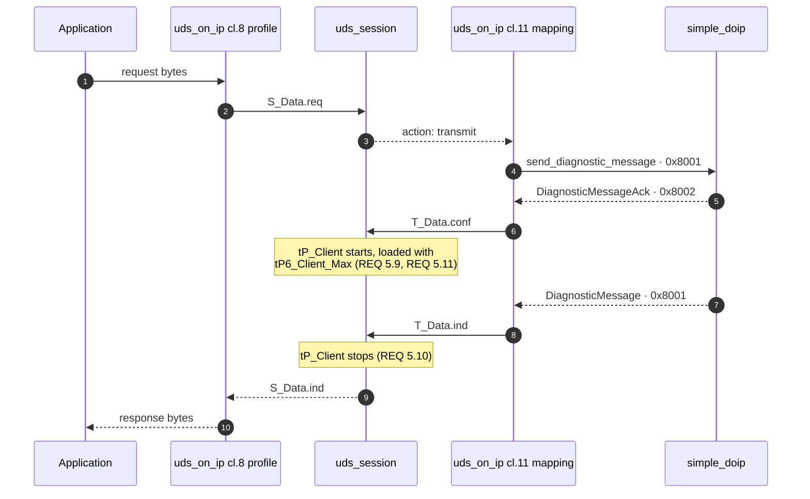
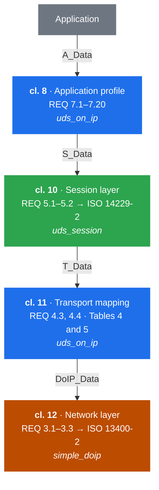
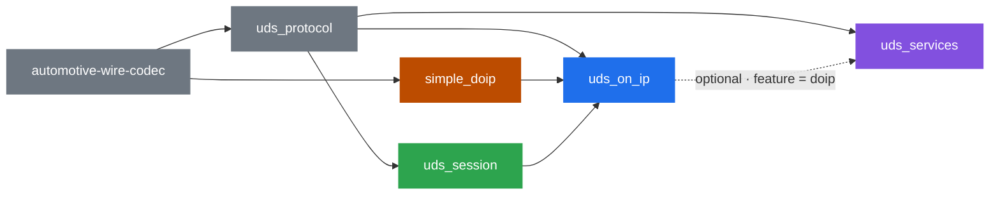
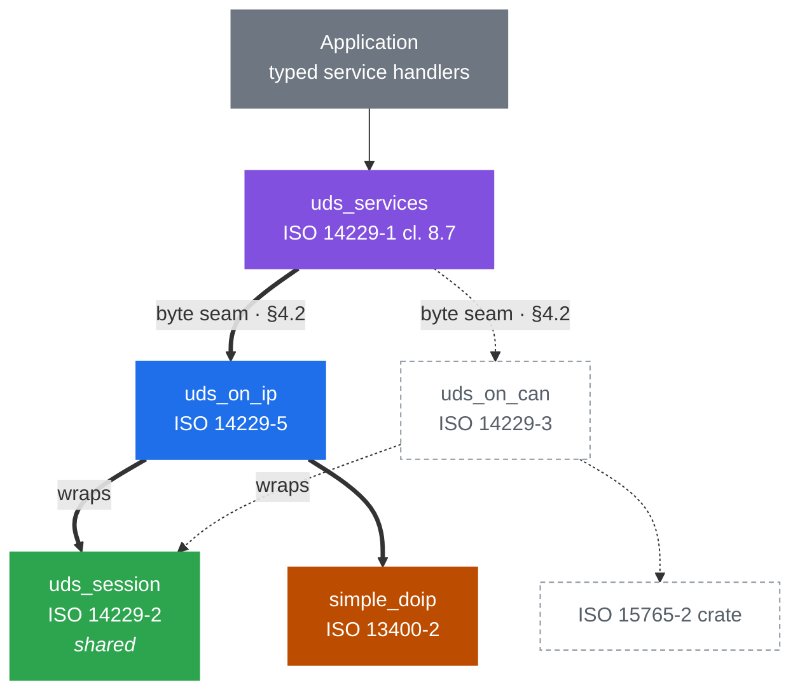

# Architecture

This document describes the **proposed** layout of the Luminar automotive
diagnostics stack, and `uds_on_ip`'s place in it. It is a design document, not a
description of the code as it stands: `uds_on_ip` today predates most of what is
written here, and [§9](#9-gap-analysis-uds_on_ip-as-it-stands-today) records the
distance between the two.

It exists so that `uds_session`, `uds_services`, and `uds_on_ip` can be designed
in parallel against one agreed set of boundaries.

> **Status: prototype-phase artifact.** Every crate in this stack is intended to
> flow through the same process — requirements, then architecture, in sequence —
> with a prototype preceding both to retire technical risk. This document belongs
> to the prototype phase. It is *not* the SWE.2 architecture, it carries no
> requirement IDs, and the architecture produced by that process supersedes it
> rather than inheriting from it.
>
> The discipline that makes a prototype-first flow sound is that the requirements
> are authored **from the standards, not from the prototype**. A requirement set
> fitted to what the prototype happens to do will agree with the code by
> construction, and the gap-closing step will find nothing — which is the failure
> mode this ordering exists to prevent. Read what follows as evidence about what
> is *buildable*, never as evidence about what is *required*.

> **A note on spec citations.** This repository contains no copy of any ISO
> standard, and the standards remain ISO's — nothing here reproduces their text
> at length. Clause and table numbers below were read against copies held
> outside this repository and are safe to check.
>
> These citations are the **informal tier**. The formal tier is the sphinx-needs
> requirement set described in [§10](#10-traceability); prose in this document
> is not a traceable artifact and must not be cited as one. `simple_doip`'s
> ARCHITECTURE.md bans numbered locators outright, after a review found
> fabricated ones there — read that as a snapshot of an earlier position rather
> than as settled policy. The operative rule is *verified* locators, not *no*
> locators: if you cannot check a citation, remove it.

---

## 1. The organising idea

ISO 14229 is not one standard but a series, and it is already layered. The
stack mirrors that layering one crate per document, so that each crate's scope
question — "does this belong here?" — is answered by asking which document
specifies the behaviour.

The payoff is reuse. A session layer that reads no clock and calls no transport
serves CAN, DoIP, K-line and simulation alike; a service dispatcher that knows
how to fetch a data identifier has nothing to say about IP. Only the crates that
name a transport are bound to one.

## 2. The standards and the crate map

| Standard | Scope | Crate |
| --- | --- | --- |
| ISO 14229-1:2020 cl. 8.7 | Server response implementation rules — dispatch, NRC selection | **`uds_services`** *(proposed)* |
| ISO 14229-1:2020 cl. 7, 10–15 | Diagnostic service message definitions | **`uds_protocol`** |
| ISO 14229-2:2021 | Session layer services — `S_Data`, `tP_Client`, `tS3` | **`uds_session`** |
| ISO 14229-5:2022 | UDSonIP application profile; `T_Data` ↔ `DoIP_Data` mapping | **`uds_on_ip`** |
| ISO 13400-2:2019 | DoIP — framing, `DoIP_Data`, routing activation | **`simple_doip`** |
| — | Zero-copy `no_std` codec traits | **`automotive-wire-codec`** |

ISO 14229-5 clause 7 enumerates its own content as a table of REQ numbers, and
that table is the definition of `uds_on_ip`'s scope. Anything not in it belongs
to another crate.

## 3. Layer responsibilities

Each subsection states what a crate owns and — more usefully — what it must
*not* acquire.

### 3.1 `simple_doip` — ISO 13400-2

Owns DoIP framing, the TCP/UDP sockets, routing activation, alive-check, vehicle
identification, and the `DoIP_Data.req/.ind/.conf` primitives.

**Must not know what a UDS message means.** Its `DiagnosticMessage` treats the
payload as an opaque byte string, and that is the property that keeps it
reusable. This holds today: the only UDS-shaped bytes in the crate are inside
its own test module.

A consequence worth stating plainly: ISO 13400-2:2019 defines payload types
`0x8001`–`0x8003` only. The periodic-response payload type `0x8004` is
introduced by ISO 14229-5, so it is **not** `simple_doip`'s to name. It reaches
`uds_on_ip` through the `PayloadType::Reserved(u16)` passthrough.

### 3.2 `uds_protocol` — ISO 14229-1 messages

Owns the encode/decode of every diagnostic service message, built on
`automotive-wire-codec`'s borrowed-first traits. `Request<'a>` and `Response<'a>`
borrow from the caller's buffer.

**Must not acquire dispatch, policy, or session state.** It is a codec. The
absence of any handler trait in `src/services/` today is a property to preserve,
not an omission to fix.

### 3.3 `uds_session` — ISO 14229-2

Owns the session layer: the `S_Data` primitives, the `tP_Client` timer, the
`tS3` timers, and response-pending (NRC `0x78`) handling. Sans-io: it reads no
clock and touches no transport, taking a caller-supplied monotonic millisecond
timestamp and returning actions to drain.

**Must not learn which transport it is running over.** ISO 14229-2:2021 9.1.2
splits `tP_Client`'s reload parameters four ways depending on whether the
transport offers a `T_DataSOM.ind` primitive. The session layer deliberately
does not distinguish the cases: it holds a *default* and an *enhanced* reload
parameter, and the transport-binding layer decides which pair those are.

### 3.4 `uds_on_ip` — ISO 14229-5

Owns four things:

1. **Timing parameter supply.** DoIP has no `T_DataSOM.ind`, so `uds_on_ip`
   supplies `tP6_Client_Max` / `tP6*_Client_Max` as the session layer's default
   and enhanced reload parameters (ISO 14229-2:2021 REQ 5.11).
2. **Primitive adaptation.** The `T_PDU` ↔ `DoIP_PDU` parameter mapping
   (ISO 14229-5:2022 REQ 4.3, REQ 4.4, Tables 4 and 5). Most importantly it
   derives `T_Data.conf` from the DoIP **acknowledgement** (`0x8002`/`0x8003`),
   not from the act of sending — because `tP_Client` starts on `T_Data.conf`
   (ISO 14229-2:2021 REQ 5.9).
3. **Channel storage.** `uds_session` requires per-channel timer storage from
   its caller; `uds_on_ip` is that caller and owns the allocation.
4. **The UDSonIP profile.** REQ 7.8–7.11 (TCP close and re-activation around
   DiagnosticSessionControl and ECUReset), REQ 7.16 (`0x8004` periodic
   responses), REQ 7.17 (periodic record length limit), REQ 7.20 (unsolicited
   responses do not reset `tS3_Server`).

**Must not learn what a service is.** No data identifier, routine identifier, or
service-specific policy belongs here. Its server-side interface is a byte seam.

### 3.5 `uds_services` — ISO 14229-1 cl. 8.7 *(proposed)*

Owns the ergonomic layer: per-service handler traits, the dispatch table, and
the negative-response rules of clause 8.7 — service not supported, sub-function
not supported, request out of range, and the session and security gating that
produce `0x7E` and `0x33`.

**Must not name a transport.** It receives session and security state as
parameters rather than depending on `uds_session`, and it reaches a transport
only through an optional, feature-gated integration ([§4.3](#43-transport-integration)).

## 4. The seams

Three interfaces hold the stack together. Each is designed so that either side
can be built before the other exists.

### 4.1 Session seam — `uds_on_ip` ⇄ `uds_session`

Bidirectional, because of the sandwich in [§8.1](#81-protocol-layering):
`uds_on_ip` pushes `S_Data.req` **down** from the application profile, and feeds
`T_Data.conf` / `T_Data.ind` **up** from the transport mapping. Both edges
belong to `uds_on_ip`, which is what a sans-io session layer requires of its
caller.

It drives the session layer through a trait rather than a direct dependency, so
it can ship an interim in-crate implementation while `uds_session` is still
being specified, and swap without a public API change.

```rust
pub trait SessionLayer {
    fn s_data_req(&mut self, now_ms: u32, ch: ChannelId, ai: Ai, data: &[u8])
        -> Result<(), SError>;
    fn t_data_conf(&mut self, now_ms: u32, ch: ChannelId, result: TResult);
    fn t_data_ind(&mut self, now_ms: u32, ch: ChannelId, data: &[u8]);
    fn poll(&mut self, now_ms: u32) -> Option<SessionAction<'_>>;
}
```

`Ai` carries the ISO 14229-2 addressing triple — source address, target address,
and target address type (physical or functional). A `ChannelId` names one
logical communication channel; ISO 14229-2:2021 9.6 Table 7 allocates a
`tP_Client` timer per channel, physical and functional alike.

### 4.2 Handler seam — `uds_services` → `uds_on_ip`

`uds_on_ip`'s server side accepts a byte-level handler and never inspects what
flows through it.

```rust
pub trait RequestHandler {
    fn handle(&mut self, ctx: &Ctx, request: &[u8], out: &mut impl Writer) -> Outcome;
}
```

`Ctx` carries the active session and security level — state `uds_on_ip` learns
from the session layer and passes through without interpreting.

### 4.3 Transport integration

`uds_services` owns the traits; the binding to a transport is an optional
feature, which keeps the dependency edge pointing one way and leaves
`uds_on_ip` ignorant of services.

```toml
# uds_services/Cargo.toml
[features]
doip  = ["dep:uds_on_ip"]
# docan = ["dep:uds_on_can"]   # later, same shape
```

## 5. Where manufacturer-specific types enter

Data identifiers, routine identifiers, and most DTCs are vehicle-manufacturer
specific — ISO 14229-1 fixes ranges and a small set of standardised values, not
the catalogue. The library therefore cannot own those enumerations. The
application supplies them as associated types:

```rust
pub trait UdsServer {
    type Did:  DataIdentifier;      // application's enum
    type Rid:  RoutineIdentifier;
    type Sess: SessionType;
}

pub trait ReadDataByIdentifier: UdsServer {
    fn read(&mut self, did: Self::Did, out: &mut impl Writer) -> Result<(), Nrc>;
}
```

This is what makes the compiler the completeness check the design is aiming for.
Adding a variant to the application's `Did` enum breaks its own exhaustive
`match`, so a newly defined identifier cannot silently go unhandled. A service
the application does not implement at all answers `serviceNotSupported`
automatically.

Open design question, tracked in `uds_services` rather than here: whether
per-service traits plus a `uds_server! { .. }` assembly macro is worth a
proc-macro dependency, versus one trait whose default methods return
`serviceNotSupported`. The macro extends the compile-time completeness signal
from the identifier level up to the service level.

## 6. Timing ownership

Timers are the easiest thing to duplicate across layers by accident, so
ownership is stated explicitly.

| Timer | Owner | Notes |
| --- | --- | --- |
| `tP_Client` | `uds_session` | One per logical communication channel, physical and functional alike (ISO 14229-2:2021 REQ 5.26, Table 7). Starts on `T_Data.conf`, stops on `T_Data.ind` (REQ 5.9, REQ 5.10). |
| default / enhanced reload values | `uds_on_ip` | `tP6_Client_Max` / `tP6*_Client_Max`, because DoIP has no `T_DataSOM.ind` (REQ 5.11). |
| `tP3_Client_Phys`, `tP3_Client_Func` | `uds_session` | One per physical and per functional channel respectively (ISO 14229-2:2021 REQ 5.26, Table 7). Minimum spacing before the next request when none is required. |
| `tS3_Client`, `tS3_Server` | `uds_session` | Periodic and unsolicited responses must not reset `tS3_Server` (ISO 14229-5:2022 REQ 7.20). |
| `tP2_Server`, `tP4_Server` | `uds_services` | Server-side performance requirements, bound to service execution. |
| TCP connect / routing-activation timeouts | `simple_doip` | Transport-level, no UDS meaning. |

## 7. Data flow

### 7.1 Client, physically addressed

This is the canonical path, and it shows exactly where `uds_on_ip` meets
`simple_doip`. Both `uds_on_ip` participants are the same crate — the profile
half above the session layer, the mapping half below it.



The step worth dwelling on is 5→6. `tP_Client` starts on the **acknowledgement**,
not on the send. Getting that wrong shortens every timeout in the stack by one
network round trip, and it is the divergence recorded in
[§9](#9-gap-analysis-uds_on_ip-as-it-stands-today).

An NRC `0x78` arriving at step 8 reloads the timer with the enhanced parameter
rather than completing the request.

### 7.2 Other paths

**Client, functionally addressed.** Identical until the response: a functional
request is answered by *several* servers behind the gateway. `tP_Client` reloads
on each response, and its expiry — not a single response — is the signal that no
more are coming (ISO 14229-5:2022 Figure 8). A functional request therefore
yields a stream of responses, not one.

**Client, session change or ECU reset.** The server closes the TCP connection
after its positive response and before executing the service. `uds_on_ip`
establishes a new connection *and repeats routing activation* before diagnostic
communication continues (REQ 7.8–7.11). This is specified behaviour, not error
recovery, and should be modelled as such.

**Server.** A diagnostic message arrives, becomes `T_Data.ind`, and is offered to
the session layer, which decides whether it is admissible. Admitted requests
reach the `RequestHandler` seam; `uds_services` dispatches to the application's
typed handler and encodes the response, which returns down the same path.

**Periodic responses.** Payload type `0x8004` bypasses the request/response
correlation path entirely and is surfaced out-of-band, without resetting
`tS3_Server` (REQ 7.16, REQ 7.20).

## 8. Two different graphs

The protocol layering and the Cargo dependency graph are not the same shape, and
conflating them is the easiest way to misread this design.

### 8.1 Protocol layering

ISO 14229-5 clause 7 numbers its requirements by OSI layer, descending — which
is why the REQ numbers look arbitrary until the scheme is visible. `REQ 7.x` is
the application layer, `REQ 5.x` the session layer, `REQ 4.x` the transport
layer, `REQ 3.x` the network layer.



The two blue boxes are the same crate. That is the sandwich.

**`uds_on_ip` sits both above and below `uds_session`.** The application-profile
half is above it; the transport adaptation half is below it. `uds_on_ip` wraps
the session layer rather than stacking on top of it, and drives it from both
edges — pushing `S_Data.req` down on the outbound path, feeding `T_Data.conf`
and `T_Data.ind` up from the transport. A sans-io session layer supports this
naturally, because the caller owns both edges by construction.

Note also that the A_Data ↔ S_Data parameter mapping is specified by ISO
14229-2 clause 7, not by -5. That mapping is `uds_session`'s; `uds_on_ip` meets
it at the S_Data boundary rather than reimplementing it.

### 8.2 Cargo dependency graph

Arrows point from a crate to the crates that depend on it, so reading left to
right is also publication order.



This one is acyclic and linear because `uds_on_ip` depends on both neighbours
even though it surrounds one of them — the sandwich in §8.1 costs nothing here,
since `uds_session` never depends back.

### 8.3 What a transport swap replaces

The sandwich in §8.1 invites a reasonable question: if `uds_on_ip` surrounds the
session layer, what does it mean to target a different transport?

The answer is that a transport binding is not a layer swapped *within* a stack.
It is a complete A_Data↔wire path wrapped around the shared session core, and
swapping means replacing the binding together with its transport — two crates
out, two in — while the session, message, and service crates stay put.

Thick edges are the stack that exists today; dotted edges are the CAN binding
as it would attach.



Each binding wraps the same `uds_session` the same way, and neither knows the
other exists. This is why the session layer must never learn its transport: it
is the piece that survives the swap. `uds_protocol` likewise feeds both.

For application code the swap point is the byte seam of §4.2, not `uds_on_ip`'s
own API — a typed server implements `uds_services` traits and reaches a binding
through the feature gate of §4.3.

**The limit, stated plainly.** The diagnostic *conversation* is portable;
connection setup is not, and no API should pretend otherwise. DoIP has TCP
connections, routing activation, vehicle identification and alive-check; CAN has
none of these. A `connect()` that looked identical across both would be lying,
and the lie would surface the moment someone needed a routing activation type or
a CAN identifier layout. The portable surface is defining identifiers,
implementing handlers, and exchanging requests. Establishing and configuring the
link is a real seam in the application, and the architecture says so rather than
papering over it.

*(ISO 14229-3 and ISO 15765-2 are named here as the CAN analogues by structure.
Neither is held in the spec set this document was checked against, so no clause
numbers are cited for them — see the note on citations at the top.)*

### 8.4 Publication order

Publication follows the dependency graph; crates.io rejects git dependencies.
Current state:

| Crate | crates.io | Blocker |
| --- | --- | --- |
| `automotive-wire-codec` | 0.3.0 | — |
| `uds_protocol` | 0.0.2 | `main` is at 0.1.0; the release PR has been open since 2026-07-30 |
| `simple_doip` | unpublished | Publication tooling in flight |
| `uds_on_ip` | unpublished | Both of the above |
| `uds_session` | unpublished | Pre-implementation |
| `uds_services` | does not exist | — |

## 9. Gap analysis: `uds_on_ip` as it stands today

The crate predates this design. Recorded so the distance is explicit.

**Dependencies are current.** The crate tracks the heads of both upstreams and
builds against them; the migration to their borrowed, zero-copy types — which
removed the owned generic abstraction (`ProtocolRequest`, `ProtocolResponse`,
`UdsSpec`, `DiagnosticDefinition`) the original public API was built on — has
already been done. The gaps below are design gaps, not staleness.

- **Session logic lives here rather than in `uds_session`** — tester-present
  keepalive, response timing, and NRC `0x78` handling are implemented in
  `src/client.rs` and are interim by construction.
- **`tP_Client` starts on send, not on the DoIP acknowledgement**, so its origin
  differs from ISO 14229-2:2021 REQ 5.9.
- **Timing configuration carries P2-flavoured names** — `response_timeout` and
  `response_pending_timeout` are really `tP6_Client_Max` and `tP6*_Client_Max`
  on DoIP.
- **Functional addressing collapses to a single response**, so the multi-server
  fan-out of ISO 14229-5:2022 Figure 8 cannot be expressed.
- **Periodic responses (`0x8004`) are unhandled.**
- **`tP3_Client_Phys` / `tP3_Client_Func` are absent** — the minimum spacing
  before a subsequent request when no response is required.
- **Reconnection is framed as resilience** rather than as REQ 7.8/7.10
  conformance.
- **No server role.**

## 10. Traceability

`uds_session` has already settled the apparatus, and `uds_on_ip` should adopt it
rather than invent a second one. The shape, for reference while designing:

- **Requirements are sphinx-needs directives**, one `llr` per requirement,
  carrying `:id:`, `:status:`, `:integrity_level:`, `:target_level:`,
  `:origin:`, `:source:`, and `:tags:`.
- **`:source:` holds the spec locators**, semicolon-separated — the same format
  used in prose throughout this document, so citations here port directly into
  requirements without rewriting.
- **`:origin:` classifies provenance** — transcribed from a standard, or
  derived. Derived requirements carry the reasoning that produced them, because
  that reasoning cannot be reconstructed later.
- **`impl` and `test` needs are generated from source annotations**, so code and
  tests link back to requirement IDs rather than being matched up by hand.
- **`needs.json` is a published interface**, keyed by `version` and consumed
  across repositories through `needs_external_needs`.

Two consequences for this crate specifically:

1. It needs its own ID prefix. `uds_session` pins
   `^UDSS_LLR_\d{4}$|^UDSS_(IMPL|TEST)_[A-Z0-9_]+$`; `uds_on_ip` will need an
   equivalent regex over its own namespace.
2. The seams in [§4](#4-the-seams) should ultimately be expressed as *links* to
   `uds_session`'s requirement IDs, not as restatements of them. A restated
   requirement is a requirement that can drift. Consuming `uds_session`'s
   `needs.json` is what makes the seam checkable rather than aspirational.

## 11. Invariants to preserve

1. A crate's scope is decided by which standard specifies the behaviour, not by
   convenience.
2. `simple_doip` never learns what a UDS message means.
3. `uds_protocol` stays a codec — no dispatch, no policy, no session state.
4. `uds_session` never learns its transport, and never reads a clock.
5. `uds_on_ip` never learns what a service is.
6. `uds_services` never names a transport outside a feature gate.
7. Every timer has exactly one owner (§6).
8. Spec locators are verified or absent.
